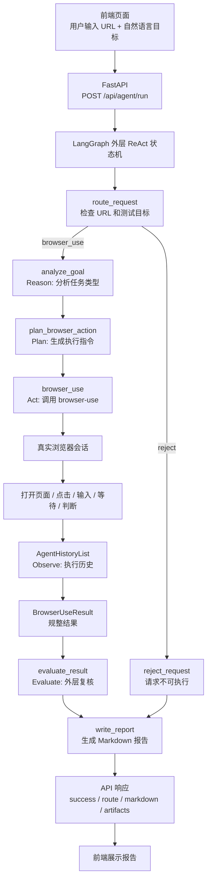
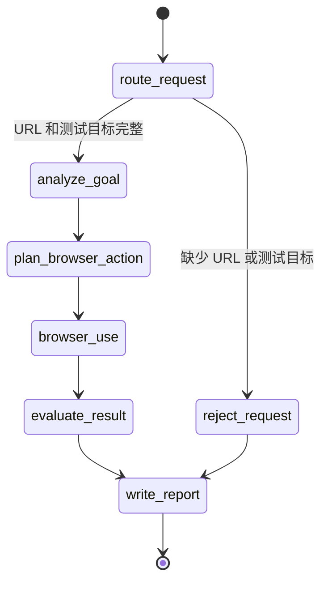
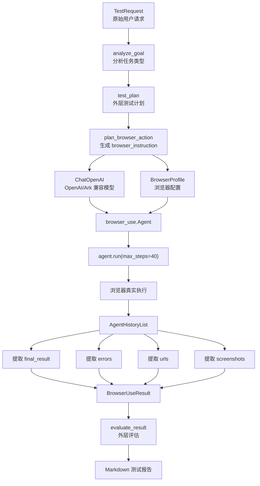

# Browser-Use 自动化测试 Agent 汇报文档

本项目是一个面向前端接入的自动化测试 Agent。用户只需要在页面输入：

- 目标页面 URL
- 自然语言测试目标
- 是否打开浏览器
- 超时时间等基础参数

后端会通过 LangGraph 外层状态机接收请求，并把有效任务交给 [browser-use](https://github.com/browser-use/browser-use) 执行真实浏览器自动化操作。最终返回 Markdown 测试报告、执行状态、访问过的 URL、错误信息和截图产物路径。

本轮已经验证成功的场景：

```text
目标页面：https://www.litmedia.ai/
测试目标：测试登录功能
登录凭证：lit511@qq.com / 123456
结果：登录成功
```

截图中的报告显示：

- 测试结果：通过
- 执行步数：7
- 耗时：86.49 秒
- 成功点击 Login 按钮
- 成功输入邮箱和密码
- 成功提交登录表单
- 登录后页面右上角状态发生变化
- 登录弹窗消失，页面正常显示

---

## 0. 汇报结论

可以这样概括当前成果：

```text
我们已经完成了一个初版自动化测试 Agent。
用户在前端输入目标 URL 和自然语言测试目标后，系统会通过 LangGraph 做外层 ReAct 流程编排，
先分析任务、生成测试计划，再交给 browser-use 驱动真实浏览器完成点击、输入、等待和结果判断，
最后由外层状态机复核结果并返回一份中文 Markdown 自动化测试报告。
```

本次验证重点：

| 验证项 | 结果 |
|---|---|
| 前端输入自然语言测试目标 | 已完成 |
| 后端 API 接收并执行任务 | 已完成 |
| LangGraph 外层 ReAct 状态机编排 | 已完成 |
| browser-use 驱动真实浏览器 | 已完成 |
| 有头模式显示浏览器操作过程 | 已完成 |
| 支持视觉模型识别页面截图 | 已完成 |
| LitMedia 登录功能测试 | 已通过 |
| 中文测试报告输出 | 已完成 |

当前系统已经具备“前端接入”的雏形，不再依赖命令行交互。后续可以在这个基础上继续扩展任务队列、历史报告、账号管理、失败截图归档和更细的测试断言。

---

## 1. 项目目标

这个 Agent 的目标不是写死某一条测试脚本，而是让用户用自然语言描述测试目标，然后由 AI 自主完成页面操作。

例如用户输入：

```text
测试一下这个页面的登录功能，登录凭证：lit511@qq.com、123456
```

系统会自动完成：

```text
打开页面
识别登录入口
点击登录按钮
识别邮箱输入框
输入账号
识别密码输入框
输入密码
提交登录
等待页面变化
判断登录是否成功
输出测试报告
```

---

## 2. 当前最终架构

当前项目已经切换为 **LangGraph 外层 ReAct 状态机 + browser-use 核心执行引擎**。

之前实现过的方案包括：

- 自研 Playwright 执行器
- page_agent 工具
- 标准 LangChain Agent + Tool
- 全页面链接巡检 crawler

这些旧方案已经不再作为主路径。现在主路径统一为：

```text
前端
  -> FastAPI
  -> LangGraph ReAct 状态机
  -> 分析任务
  -> 生成测试计划
  -> browser-use Agent
  -> 浏览器真实操作
  -> 外层结果评估
  -> Markdown 测试报告
```

为什么切到 browser-use：

| 方案 | 优点 | 问题 |
|---|---|---|
| 纯 Playwright 脚本 | 稳定、可控、适合固定流程 | 需要提前写死选择器和步骤 |
| Playwright CLI/codegen | 适合录制固定脚本 | 不适合用户每次输入不同自然语言目标 |
| 自研 page_agent | 可以包装页面动作 | 需要自己维护元素识别、动作规划和错误恢复 |
| 标准 LangChain Agent + Tool | 工具调用链清晰 | 页面视觉理解、浏览器状态管理仍要自己补齐 |
| browser-use | 自带浏览器理解、动作执行、历史记录和多步任务能力 | 需要处理模型兼容和运行环境配置 |

因此当前选择：

```text
LangGraph 负责外层 ReAct 流程编排。
browser-use 负责真实浏览器自动化。
前端负责用户输入和报告展示。
```

---

## 3. 总体架构图



---

## 4. LangGraph 状态机

LangGraph 现在负责外层 ReAct 流程控制。它不直接操作 DOM，也不替代 browser-use 的内部多步执行，但会在调用 browser-use 前后增加可解释的 Reason、Plan、Observe、Evaluate 节点。



节点说明：

| 节点 | 作用 |
|---|---|
| `route_request` | 检查请求是否包含目标 URL 和自然语言测试目标 |
| `analyze_goal` | Reason 节点，分析任务类型，例如登录、导航、表单或通用页面行为 |
| `plan_browser_action` | Plan 节点，把任务分析整理成 browser-use 更容易执行的中文指令 |
| `browser_use` | Act 节点，调用 browser-use 执行真实浏览器自动化 |
| `evaluate_result` | Observe/Evaluate 节点，根据 browser-use 结果做外层复核 |
| `reject_request` | 缺少 URL 或测试目标时的安全出口 |
| `write_report` | 输出最终 Markdown 报告 |

代码位置：

```text
test_agent/graph/builder.py
test_agent/graph/nodes.py
test_agent/graph/routing.py
```

### 4.1 节点和路由的区别

在当前项目里：

| 概念 | 含义 | 当前例子 |
|---|---|---|
| 节点 node | 真正执行一段逻辑的函数 | `route_request`、`analyze_goal`、`plan_browser_action`、`browser_use`、`evaluate_result` |
| 路由 route | 决定下一步走哪个节点的判断逻辑 | `route_after_request` |
| 状态 state | 节点之间传递的数据 | `TestAgentState` |

可以这样理解：

```text
节点 = 干活的人
路由 = 决定下一个让谁干活
状态 = 大家交接时传的任务单
```

当前路由逻辑很简单：

```text
如果 URL 和测试目标都存在：
  route_request -> analyze_goal -> plan_browser_action -> browser_use -> evaluate_result -> write_report

如果 URL 或测试目标缺失：
  route_request -> reject_request
```

这也是为什么 `route_request` 看起来像“开始判断路由”。严格来说：

```text
route_request 节点负责检查请求并写入 route 字段。
route_after_request 路由函数负责读取 route 字段，并决定下一条边走向哪个节点。
```

### 4.2 当前 ReAct 逻辑

当前项目的 ReAct 逻辑分两层：

| 层级 | 负责内容 |
|---|---|
| LangGraph 外层 ReAct | 分析任务、生成计划、调用 browser-use、复核结果、生成报告 |
| browser-use 内层 ReAct | 根据页面截图和 DOM 观察页面，决定点击、输入、等待或跳转 |

外层 ReAct 节点对应关系：

```text
Reason   -> analyze_goal
Plan     -> plan_browser_action
Act      -> browser_use
Observe  -> BrowserUseResult / AgentHistoryList
Evaluate -> evaluate_result
Report   -> write_report
```

这样做的好处：

```text
1. 用户能在报告里看到测试计划和 ReAct 轨迹。
2. 后续可以在 plan_browser_action 前增加人工确认。
3. 后续可以在 evaluate_result 后增加失败重试。
4. 后续可以把不同任务类型路由到不同执行器。
5. browser-use 仍然专注做最擅长的真实浏览器操作。
```

---

## 5. browser-use 执行链路

browser-use 是当前真正负责网页操作的核心引擎。LangGraph 外层会先把用户目标整理成更明确的 browser-use task，再交给它执行。



核心代码在：

```text
test_agent/browser_use_runner.py
```

核心调用逻辑：

```python
agent = Agent(
    task=_build_task(request),
    llm=llm,
    browser_profile=profile,
    use_vision=True,
    step_timeout=max(30, int(request.timeout_ms / 1000)),
    max_failures=3,
    source="langchain1-browser-use",
)

history = await agent.run(max_steps=40)
```

### 5.1 自然语言任务如何传给 browser-use

系统不会把用户输入拆成固定脚本，而是先由 LangGraph 外层 ReAct 节点分析目标，再组装成一个更完整的 browser-use task。这个 task 会告诉 Agent：

```text
你是一个自动化网页测试 Agent。
请打开目标 URL。
根据用户的中文测试目标操作页面。
不要编造已经完成的操作。
每一步都要基于当前页面状态判断。
如果找不到元素，要说明原因。
最终输出中文测试报告。
```

这样 browser-use 可以根据实际页面情况自主决定：

```text
点哪个按钮
等哪个弹窗
往哪个输入框填账号
是否需要等待页面加载
登录是否真的成功
最终应该如何总结
```

### 5.3 外层 ReAct 报告字段

现在最终 Markdown 报告会额外包含：

| 字段 | 含义 |
|---|---|
| 任务类型 | 外层 `analyze_goal` 判断出的测试类型 |
| ReAct 测试计划 | 外层 `plan_browser_action` 生成的测试步骤 |
| ReAct 轨迹 | 外层状态机记录的 Reason、Plan、Act、Evaluate 过程 |
| 外层评估 | `evaluate_result` 对 browser-use 结果的复核结论 |

这几个字段让报告更适合汇报和排查。以前只知道 browser-use 最后说成功或失败；现在能看到外层 Agent 是怎么理解任务、怎么计划执行、怎么复核结果的。

### 5.2 为什么复杂页面更适合开启视觉模式

复杂页面经常存在这些情况：

```text
按钮没有稳定 id
输入框 placeholder 不标准
图标按钮没有文本
弹窗层级复杂
登录入口可能是头像、图标或菜单项
DOM 结构和视觉位置不完全一致
```

开启 `use_vision=True` 后，browser-use 不只看 DOM，也会把页面截图传给支持视觉的模型。这样模型能结合页面视觉布局判断“右上角 Login 按钮”“弹窗里的密码输入框”“提交按钮”等目标。

---

## 6. 前端交互

前端由 FastAPI 内置 HTML 页面提供。

访问地址：

```text
http://127.0.0.1:8000/
```

页面字段：

| 字段 | 说明 |
|---|---|
| 目标页面 URL | 要测试的网站地址 |
| 测试目标 | 用户自然语言描述，例如“测试登录功能” |
| 超时毫秒 | 单步或整体操作的超时时间 |
| 最大跳转数 | 保留字段，当前 browser-use 主路径不强依赖 |
| 打开浏览器 | 勾选后使用有头浏览器，能看到真实操作过程 |
| 包含跨域链接 | 保留字段，当前 browser-use 主路径不强依赖 |

前端会调用：

```http
POST /api/agent/run
```

请求示例：

```json
{
  "url": "https://www.litmedia.ai/",
  "instruction": "测试一下这个页面的登录功能，登录凭证：lit511@qq.com、123456",
  "headed": true,
  "timeout_ms": 15000,
  "max_links": 30,
  "include_cross_origin": false
}
```

响应示例：

```json
{
  "success": true,
  "route": "browser_use",
  "title": "browser-use 自动化测试报告",
  "markdown": "...",
  "artifacts": []
}
```

### 6.1 前端展示内容

当前前端页面左侧是任务输入区，右侧是报告展示区。

左侧主要负责：

```text
输入目标 URL
输入测试目标
设置超时时间
选择是否打开浏览器
点击运行测试
显示执行状态
```

右侧主要负责：

```text
展示 Markdown 测试报告
展示执行是否成功
展示访问过的 URL
展示错误信息
展示截图产物路径
```

这意味着后续接入正式产品前端时，只需要保留同样的接口协议即可，不一定使用当前内置页面。

### 6.2 演示步骤

汇报时可以按下面顺序演示：

```text
1. 打开 http://127.0.0.1:8000/
2. 在目标页面 URL 输入 https://www.litmedia.ai/
3. 在测试目标输入：
   测试一下这个页面的登录功能，登录凭证：lit511@qq.com、123456
4. 勾选“打开浏览器”
5. 点击“运行测试”
6. 观察浏览器自动打开并执行登录流程
7. 等待右侧生成 Markdown 测试报告
8. 重点展示“测试结果：通过”和“执行步骤”
```

### 6.3 截图报告如何讲

本次成功截图可以这样解读：

| 截图区域 | 汇报说明 |
|---|---|
| 左侧 URL 输入框 | 说明测试目标不是写死在代码里，而是由用户前端输入 |
| 左侧测试目标文本框 | 说明用户可以用自然语言描述浏览器行为 |
| “打开浏览器”复选框 | 说明支持有头模式，可以现场看到浏览器真实操作 |
| 右侧报告标题 | 说明后端返回的是结构化 Markdown 测试报告 |
| 测试结果：通过 | 说明本次登录场景已经跑通 |
| 执行步数和耗时 | 说明 Agent 有真实多步执行过程 |
| 访问过的 URL | 说明系统记录了浏览器访问轨迹 |
| 执行步骤 | 说明不是简单打开页面，而是完成点击、输入、提交和等待 |
| 验证结果 | 说明 Agent 会根据页面变化判断登录是否成功 |

---

## 7. 模型与 browser-use 兼容处理

接入 browser-use 时遇到了两个模型兼容问题，已经处理。

### 7.1 json_schema 与 AgentOutput 兼容

早期遇到过两类结构化输出问题。

第一类是模型接口不支持 `json_schema`：

```text
response_format.type=json_schema is not supported by this model
```

第二类是关闭强制结构化输出后，模型偶尔返回普通中文文本，导致 browser-use 无法解析 `AgentOutput`：

```text
1 validation error for AgentOutput
Invalid JSON: expected value at line 1 column 1
```

原因分别是：

```text
browser-use 每一步都需要模型返回 AgentOutput JSON。
如果启用强制结构化输出，部分模型接口可能不支持 response_format.type=json_schema。
如果关闭强制结构化输出，模型就可能不严格返回 JSON，而是先输出中文总结。
```

当前处理方式：

```python
ChatOpenAI(
    ...,
    dont_force_structured_output=not force_structured_output,
    add_schema_to_system_prompt=not force_structured_output,
)
```

项目默认：

```text
BROWSER_USE_FORCE_STRUCTURED_OUTPUT=1
```

效果：

```text
优先使用 json_schema 强制模型返回 AgentOutput JSON。
如果模型明确报 json_schema 不支持，则自动降级为 prompt schema 模式。
同时在任务指令中要求：不要在 JSON 外输出中文、Markdown 或普通文本。
```

### 7.2 image_url 不兼容

早期报错：

```text
Model do not support image input
param: image_url
```

原因：

```text
browser-use 开启视觉模式后，会把页面截图发给模型。
旧模型不支持图片输入。
```

处理过程：

```text
旧模型阶段：use_vision=False
换成支持视觉的新模型后：use_vision=True
```

当前配置：

```python
Agent(
    ...,
    use_vision=True,
)
```

效果：

```text
browser-use 可以把页面截图发给支持视觉的模型。
页面理解能力更强，适合复杂 UI、弹窗、图标按钮和视觉变化判断。
```

---

## 8. browser-use 工作目录处理

browser-use 默认会尝试写入用户目录：

```text
C:\Users\<user>\.config\browseruse
```

在当前运行环境中，这个路径可能没有权限。因此项目把 browser-use 的配置目录、profile 目录、下载目录和 trace 目录都定向到项目内：

```text
artifacts/browser_use/
```

配置在：

```text
test_agent/settings.py
```

关键逻辑：

```python
os.environ.setdefault("BROWSER_USE_CONFIG_DIR", str(BROWSER_USE_CONFIG_DIR))
os.environ.setdefault("BROWSER_USE_PROFILES_DIR", str(BROWSER_USE_PROFILES_DIR))
os.environ.setdefault("BROWSER_USE_DOWNLOADS_DIR", str(BROWSER_USE_DOWNLOADS_DIR))
os.environ.setdefault("BROWSER_USE_TRACES_DIR", str(BROWSER_USE_TRACES_DIR))
```

这样可以避免 browser-use 写入系统用户目录导致权限错误。

---

## 9. 结果规整与容错

browser-use 返回的是 `AgentHistoryList`，其中部分字段在失败或中断时可能是 `None`。

例如曾经遇到：

```text
success = None
errors = [None]
```

如果直接塞进 Pydantic 模型，会触发校验错误。因此在 `browser_use_runner.py` 中做了容错：

```python
raw_errors = _safe_call(history, "errors", default=[]) or []
errors = [str(error) for error in raw_errors if error is not None]
raw_success = _safe_call(history, "is_successful", default=None)
success = bool(raw_success) if raw_success is not None else not bool(errors)
```

规整后的结果结构：

```python
class BrowserUseResult(BaseModel):
    success: bool = False
    final_result: str = ""
    errors: list[str] = Field(default_factory=list)
    urls: list[str] = Field(default_factory=list)
    screenshots: list[str] = Field(default_factory=list)
    steps: int = 0
    duration_seconds: float | None = None
```

### 9.1 为什么要做结果规整

前端需要稳定的数据结构。如果后端直接把 browser-use 的原始历史对象返回给前端，会有几个问题：

```text
字段可能为 None
结构不适合前端直接渲染
错误信息分散在 history 里
截图、URL、最终结果需要单独提取
不同失败场景下返回形态不完全一致
```

因此项目增加了 `BrowserUseResult`，统一成：

```text
success: 是否成功
final_result: browser-use 最终总结
errors: 错误列表
urls: 访问过的 URL
screenshots: 截图路径
steps: 执行步数
duration_seconds: 耗时
```

这样前端和后续报告系统只依赖稳定协议，不需要理解 browser-use 的内部对象。

---

## 10. 登录测试成功案例

本次成功案例：

```text
URL: https://www.litmedia.ai/
目标: 测试一下这个页面的登录功能
账号: lit511@qq.com
密码: 123456
```

执行结果摘要：

```text
测试结果：通过
执行步数：7
耗时：86.49s
```

报告中记录的关键步骤：

```text
1. 打开目标页面 https://www.litmedia.ai/
2. 点击页面右上角的 Login 按钮
3. 在邮箱输入框输入 lit511@qq.com
4. 在密码输入框输入 123456
5. 点击 Login 按钮提交登录表单
6. 等待页面响应，验证登录状态
```

验证结果：

```text
登录按钮点击后显示加载状态，请求已提交
登录完成后，页面右上角的 Login 按钮变为用户头像图标
登录弹窗消失，页面正常显示 LitMedia 首页内容
页面导航栏和功能按钮正常显示
```

最终结论：

```text
LitMedia 平台登录功能工作正常。
测试账号 lit511@qq.com / 123456 可以成功登录系统。
```

### 10.1 本次成功说明了什么

这个案例验证了几件关键事情：

```text
1. Agent 能打开真实线上页面。
2. Agent 能理解中文测试目标。
3. Agent 能识别登录入口。
4. Agent 能处理弹窗或登录表单。
5. Agent 能输入用户给定的账号密码。
6. Agent 能点击提交按钮。
7. Agent 能等待页面状态变化。
8. Agent 能基于页面变化判断登录成功。
9. Agent 能把执行过程整理成中文报告。
10. 前端能正常展示后端返回结果。
```

这比固定脚本更有价值，因为用户换一个目标，例如：

```text
测试顶部导航栏是否都能正常跳转
测试 Create Video 按钮是否能进入创建页
测试登录后用户菜单是否能展开
测试 pricing 页面是否能正常打开
```

系统仍然可以通过自然语言任务交给 browser-use 去执行，而不是每个场景都重新写一套 Playwright 脚本。

---

## 11. 当前主要文件

```text
test_agent/
  agent_service.py        # 前端调用的服务层
  web_app.py              # FastAPI + 内置前端页面
  browser_use_runner.py   # browser-use 执行封装
  models.py               # 请求、结果、状态协议
  settings.py             # API Key、browser-use 工作目录等配置
  graph/
    builder.py            # LangGraph 状态机装配
    nodes.py              # route/browser_use/reject/write_report 节点
    routing.py            # 条件边路由

run_web_app.py            # 启动 FastAPI 前端服务
requirements.txt          # Python 依赖
```

---

## 12. 当前依赖

核心依赖：

```text
browser-use
langgraph
fastapi
uvicorn
pydantic
python-dotenv
playwright
```

项目已从旧的自研 Playwright runner 切换到 browser-use。

旧主路径已移除：

```text
page_agent
standard_agent
playwright_runner
link_crawler
```

---

## 13. 当前状态

已完成：

- 前端页面可用
- FastAPI API 可用
- LangGraph 外层状态机可用
- browser-use 接入完成
- browser-use 视觉模式已重新开启
- Ark/OpenAI 兼容配置已接入
- browser-use 工作目录已迁移到项目内
- 登录场景已成功跑通

服务地址：

```text
http://127.0.0.1:8000/
```

---

## 14. 后续可扩展方向

当前是初版可运行版本，后续可以继续增强：

| 方向 | 说明 |
|---|---|
| 测试历史 | 保存每次执行的 URL、目标、报告、截图和耗时 |
| 报告管理 | 在前端提供历史报告列表和详情页 |
| 账号管理 | 把测试账号从自然语言中拆出，改为安全的凭证配置 |
| 任务队列 | 支持多个测试任务排队执行 |
| 失败重试 | 对网络抖动、元素加载慢、模型偶发判断失败做自动重试 |
| 截图归档 | 将 browser-use 截图复制到项目 artifacts 目录统一管理 |
| 断言增强 | 允许用户配置必须出现的文本、URL 变化或页面状态 |
| 巡检模式 | 针对导航栏、按钮、链接做批量跳转检查 |
| 多浏览器 | 支持 Chromium、Chrome、Edge 等不同浏览器配置 |
| 多环境 | 支持测试环境、预发环境、生产环境 URL 切换 |

---

## 15. 汇报话术参考

可以按这段话讲：

```text
这个项目现在已经完成了一个 browser-use 驱动的自动化测试 Agent 初版。
前端负责收集 URL 和自然语言测试目标，FastAPI 负责接收请求，
LangGraph 作为外层状态机判断任务是否可执行并组织流程，
browser-use 负责真正打开浏览器、理解页面、执行点击输入等待等操作。

我们已经用 LitMedia 官网登录场景做了验证。
用户输入登录测试目标和账号密码后，Agent 成功打开页面、点击 Login、
填写邮箱和密码、提交登录，并根据页面右上角状态变化判断登录成功。
最终前端展示了中文 Markdown 测试报告，包括执行步数、耗时、访问 URL、
执行步骤、验证结果和失败原因。

这个方案相比固定 Playwright 脚本，更适合前端自然语言接入；
相比自研 page_agent，也减少了元素识别、截图理解、动作规划和浏览器状态维护的实现成本。
```
