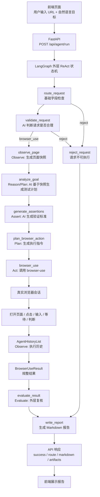
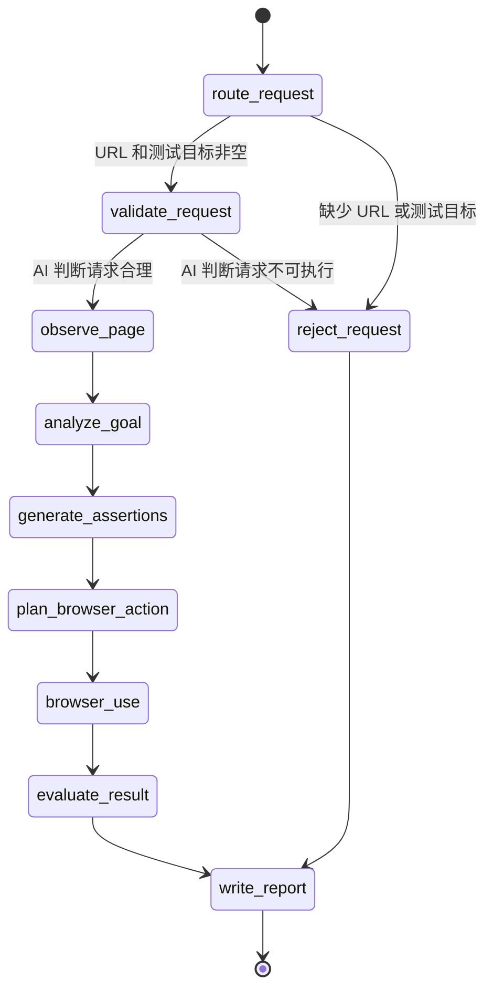
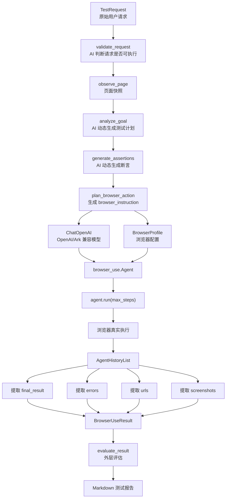

# Browser-Use 自动化测试 Agent 设计方案

本项目是一个面向前端接入的自动化测试 Agent。用户只需要在页面输入：

- 目标页面 URL
- 自然语言测试目标
- 是否打开浏览器
- 超时时间等基础参数

后端会通过 LangGraph 外层状态机接收请求，并把有效任务交给 [browser-use](https://github.com/browser-use/browser-use) 执行真实浏览器自动化操作。最终返回 Markdown 测试报告、执行状态、访问过的 URL、错误信息和截图产物路径。

---

## 1. 项目目标

这个 Agent 的目标不是写死某一条测试脚本，而是让用户用自然语言描述测试目标，然后由 AI 自主完成页面操作。

例如用户输入：

```text
测试一下这个页面的登录功能，使用给定测试账号完成登录并判断是否成功
```

系统会自动完成：

```text
打开页面
识别登录入口
点击登录按钮
识别邮箱输入框
输入账号
识别密码输入框
输入密码
提交登录
等待页面变化
判断登录是否成功
输出测试报告
```

---

## 2. 核心设计原则

当前项目采用 **LangGraph 外层 ReAct 状态机 + browser-use 核心执行引擎**。

设计原则如下：

| 原则 | 说明 |
|---|---|
| 前端只负责输入和展示 | 前端不写测试脚本，只收集 URL、自然语言目标、运行参数并展示报告 |
| LangGraph 负责编排 | 外层状态机负责路由、任务分析、页面快照、断言生成、计划、执行和复核 |
| browser-use 负责浏览器执行 | 页面观察、点击、输入、等待、跳转由 browser-use 在真实浏览器中完成 |
| 状态对象贯穿全流程 | 所有节点通过 `TestAgentState` 交接数据，避免节点之间隐式依赖 |
| 先观察再计划 | 在生成执行计划前先获取页面快照，让计划基于真实页面信息 |
| 先生成断言再执行 | 执行前生成可验证标准，让 browser-use 和外层评估都有判断依据 |
| 报告面向前端消费 | 后端统一输出结构化结果和 Markdown 报告，方便接入正式产品页面 |

主路径统一为：

```text
前端
  -> FastAPI
  -> LangGraph ReAct 状态机
  -> 分析任务
  -> 生成测试计划
  -> browser-use Agent
  -> 浏览器真实操作
  -> 外层结果评估
  -> Markdown 测试报告
```

## 3. 总体架构图



---

## 4. LangGraph 状态机

LangGraph 现在负责外层 ReAct 流程控制。它不直接操作 DOM，也不替代 browser-use 的内部多步执行，但会在调用 browser-use 前后增加可解释的 Reason、Plan、Observe、Evaluate 节点。



节点说明：

| 节点 | 作用 |
|---|---|
| `route_request` | 基础字段检查，只判断 URL 和测试目标是否为空 |
| `validate_request` | Reason 节点，用 AI 判断 URL 和自然语言目标是否构成可执行测试请求 |
| `observe_page` | Observe 节点，在生成测试计划前生成页面快照：截图、文本、可交互元素、候选链接 |
| `analyze_goal` | Reason/Plan 节点，AI 基于用户目标、页面快照和历史记忆动态生成任务类型与测试计划 |
| `generate_assertions` | Assert 节点，AI 根据任务目标、页面快照和测试计划生成可验证标准 |
| `plan_browser_action` | Plan 节点，把任务分析整理成 browser-use 更容易执行的中文指令 |
| `browser_use` | Act 节点，调用 browser-use 执行真实浏览器自动化 |
| `evaluate_result` | Observe/Evaluate 节点，先做执行完整性硬保护，再调用 AI 判断结果是否满足用户目标和断言 |
| `reject_request` | 缺少 URL 或测试目标时的安全出口 |
| `write_report` | 输出最终 Markdown 报告 |

代码位置：

```text
test_agent/graph/builder.py
test_agent/graph/nodes.py
test_agent/graph/routing.py
```

### 4.1 节点和路由的区别

在当前项目里：

| 概念 | 含义 | 当前例子 |
|---|---|---|
| 节点 node | 真正执行一段逻辑的函数 | `route_request`、`validate_request`、`observe_page`、`analyze_goal`、`generate_assertions`、`plan_browser_action`、`browser_use`、`evaluate_result` |
| 路由 route | 决定下一步走哪个节点的判断逻辑 | `route_after_request` |
| 状态 state | 节点之间传递的数据 | `TestAgentState` |

可以这样理解：

```text
节点 = 干活的人
路由 = 决定下一个让谁干活
状态 = 大家交接时传的任务单
```

当前路由逻辑很简单：

```text
如果 URL 和测试目标都存在，并且 AI 判断测试目标可执行：
  route_request -> validate_request -> observe_page -> analyze_goal -> generate_assertions -> plan_browser_action -> browser_use -> evaluate_result -> write_report

如果 URL 或测试目标缺失，或 AI 判断目标过于模糊：
  route_request -> reject_request
  route_request -> validate_request -> reject_request
```

这也是为什么 `route_request` 看起来像“开始判断路由”。严格来说：

```text
route_request 节点负责检查请求并写入 route 字段。
route_after_request 路由函数负责读取 route 字段，并决定下一条边走向哪个节点。
```

### 4.2 当前 ReAct 逻辑

当前项目的 ReAct 逻辑分两层：

| 层级 | 负责内容 |
|---|---|
| LangGraph 外层 ReAct | 分析任务、生成计划、调用 browser-use、复核结果、生成报告 |
| browser-use 内层 ReAct | 根据页面截图和 DOM 观察页面，决定点击、输入、等待或跳转 |

外层 ReAct 节点对应关系：

```text
Reason   -> validate_request / analyze_goal
Observe  -> observe_page / BrowserUseResult / AgentHistoryList
Assert   -> generate_assertions
Plan     -> plan_browser_action
Act      -> browser_use
Evaluate -> evaluate_result
Report   -> write_report
```

这样做的好处：

```text
1. 用户能在报告里看到测试计划和 ReAct 轨迹。
2. 后续可以在 plan_browser_action 前增加人工确认。
3. 后续可以在 evaluate_result 后增加失败重试。
4. 后续可以把不同任务类型路由到不同执行器。
5. browser-use 仍然专注做最擅长的真实浏览器操作。
```

---

## 5. browser-use 执行链路

browser-use 是当前真正负责网页操作的核心引擎。LangGraph 外层会先把用户目标整理成更明确的 browser-use task，再交给它执行。



核心代码在：

```text
test_agent/browser_use_runner.py
```

核心调用逻辑：

```python
agent = Agent(
    task=_build_task(request),
    llm=llm,
    browser_profile=profile,
    use_vision=True,
    step_timeout=max(30, int(request.timeout_ms / 1000)),
    max_failures=3,
    source="langchain1-browser-use",
)

history = await agent.run(max_steps=40)
```

### 5.1 自然语言任务如何传给 browser-use

系统不会把用户输入拆成固定脚本。现在的顺序是：

```text
1. AI 判断 URL 和测试目标是否合理。
2. 页面快照节点打开页面，提取标题、文本、可交互元素、链接和截图。
3. AI 根据“用户目标 + 页面快照 + 历史记忆”生成测试计划。
4. AI 根据“用户目标 + 页面快照 + 测试计划”生成断言。
5. plan_browser_action 把动态计划和断言整理成 browser-use task。
```

这样 browser-use 可以根据实际页面情况自主决定：

```text
点哪个按钮
等哪个弹窗
往哪个输入框填账号
是否需要等待页面加载
页面状态是否符合用户目标
最终应该如何总结
```

### 5.3 外层 ReAct 报告字段

现在最终 Markdown 报告会额外包含：

| 字段 | 含义 |
|---|---|
| 任务类型 | `analyze_goal` 基于用户目标和页面快照动态生成的测试类型 |
| ReAct 测试计划 | `analyze_goal` 基于页面快照生成的测试步骤 |
| ReAct 轨迹 | 外层状态机记录的 Reason、Plan、Act、Evaluate 过程 |
| 外层评估 | `evaluate_result` 对 browser-use 结果的复核结论 |

这几个字段让报告更适合汇报和排查。以前只知道 browser-use 最后说成功或失败；现在能看到外层 Agent 是怎么理解任务、怎么计划执行、怎么复核结果的。

`evaluate_result` 分两层：

```text
第一层：执行完整性硬保护
- browser-use errors 非空
- 浏览器页面、上下文或连接被关闭
- 最终 URL 是 about:blank
- 最终结果只有 Waited for N seconds
- browser-use 没有最终验证文本

第二层：AI 外层评估
- 读取用户原始目标
- 读取页面快照摘要
- 读取 AI 生成的测试计划
- 读取 AI 生成的断言
- 读取 browser-use 最终报告、URL、步数
- 输出 passed / confidence / reason / failed_assertions / uncertain_points
```

也就是说，语义层面的“通过、失败、无错误、未出现错误、断言是否满足”不靠关键词规则判断，而是交给 AI 结合上下文评估。

### 5.2 为什么复杂页面更适合开启视觉模式

复杂页面经常存在这些情况：

```text
按钮没有稳定 id
输入框 placeholder 不标准
图标按钮没有文本
弹窗层级复杂
登录入口可能是头像、图标或菜单项
DOM 结构和视觉位置不完全一致
```

开启 `use_vision=True` 后，browser-use 不只看 DOM，也会把页面截图传给支持视觉的模型。这样模型能结合页面视觉布局判断“右上角 Login 按钮”“弹窗里的密码输入框”“提交按钮”等目标。

---

## 6. 前端交互

前端由 FastAPI 内置 HTML 页面提供。

访问地址：

```text
http://127.0.0.1:8000/
```

页面字段：

| 字段 | 说明 |
|---|---|
| 目标页面 URL | 要测试的网站地址 |
| 测试目标 | 用户自然语言描述，例如“测试登录功能” |
| 超时毫秒 | 单步或整体操作的超时时间 |
| 最大跳转数 | 保留字段，当前 browser-use 主路径不强依赖 |
| 打开浏览器 | 勾选后使用有头浏览器，能看到真实操作过程 |
| 包含跨域链接 | 保留字段，当前 browser-use 主路径不强依赖 |

前端会调用：

```http
POST /api/agent/run
```

当前前端默认使用流式接口：

```http
POST /api/agent/run/stream
```

流式接口返回 `application/x-ndjson`，每一行是一条 JSON 事件。前端会边接收边展示 Agent 进度，例如：

```text
start              接收请求
route_request      基础字段检查
validate_request   AI 判断 URL 和测试目标是否合理
observe_page       页面快照完成
analyze_goal       AI 动态生成测试计划
generate_assertions AI 动态生成断言
plan_browser_action 整理 browser-use 执行指令
browser_use        浏览器执行完成
evaluate_result    外层评估完成
final              返回最终 Markdown 报告
```

请求示例：

```json
{
  "url": "https://example.com/",
  "instruction": "测试页面登录功能，使用测试账号完成登录并判断是否进入登录后状态",
  "headed": true,
  "timeout_ms": 15000,
  "max_links": 30,
  "include_cross_origin": false
}
```

响应示例：

```json
{
  "success": true,
  "route": "browser_use",
  "title": "browser-use 自动化测试报告",
  "markdown": "...",
  "artifacts": []
}
```

### 6.1 前端展示内容

当前前端页面左侧是任务输入区，右侧是报告展示区。

左侧主要负责：

```text
输入目标 URL
输入测试目标
设置超时时间
选择是否打开浏览器
点击运行测试
显示执行状态
```

右侧主要负责：

```text
展示 Markdown 测试报告
展示执行是否成功
展示访问过的 URL
展示错误信息
展示截图产物路径
```

这意味着后续接入正式产品前端时，只需要保留同样的接口协议即可，不一定使用当前内置页面。

---

## 7. 模型与 browser-use 兼容处理

接入 browser-use 时遇到了两个模型兼容问题，已经处理。

### 7.1 json_schema 与 AgentOutput 兼容

早期遇到过两类结构化输出问题。

第一类是模型接口不支持 `json_schema`：

```text
response_format.type=json_schema is not supported by this model
```

第二类是关闭强制结构化输出后，模型偶尔返回普通中文文本，导致 browser-use 无法解析 `AgentOutput`：

```text
1 validation error for AgentOutput
Invalid JSON: expected value at line 1 column 1
```

原因分别是：

```text
browser-use 每一步都需要模型返回 AgentOutput JSON。
如果启用强制结构化输出，部分模型接口可能不支持 response_format.type=json_schema。
如果关闭强制结构化输出，模型就可能不严格返回 JSON，而是先输出中文总结。
```

当前处理方式：

```python
ChatOpenAI(
    ...,
    dont_force_structured_output=not force_structured_output,
    add_schema_to_system_prompt=not force_structured_output,
)
```

项目默认：

```text
BROWSER_USE_FORCE_STRUCTURED_OUTPUT=1
```

效果：

```text
优先使用 json_schema 强制模型返回 AgentOutput JSON。
如果模型明确报 json_schema 不支持，则自动降级为 prompt schema 模式。
同时在任务指令中要求：不要在 JSON 外输出中文、Markdown 或普通文本。
```

### 7.2 image_url 不兼容

早期报错：

```text
Model do not support image input
param: image_url
```

原因：

```text
browser-use 开启视觉模式后，会把页面截图发给模型。
旧模型不支持图片输入。
```

处理过程：

```text
旧模型阶段：use_vision=False
换成支持视觉的新模型后：use_vision=True
```

当前配置：

```python
Agent(
    ...,
    use_vision=True,
)
```

效果：

```text
browser-use 可以把页面截图发给支持视觉的模型。
页面理解能力更强，适合复杂 UI、弹窗、图标按钮和视觉变化判断。
```

---

## 8. browser-use 工作目录处理

browser-use 默认会尝试写入用户目录：

```text
C:\Users\<user>\.config\browseruse
```

在当前运行环境中，这个路径可能没有权限。因此项目把 browser-use 的配置目录、profile 目录、下载目录和 trace 目录都定向到项目内：

```text
artifacts/browser_use/
```

配置在：

```text
test_agent/settings.py
```

关键逻辑：

```python
os.environ.setdefault("BROWSER_USE_CONFIG_DIR", str(BROWSER_USE_CONFIG_DIR))
os.environ.setdefault("BROWSER_USE_PROFILES_DIR", str(BROWSER_USE_PROFILES_DIR))
os.environ.setdefault("BROWSER_USE_DOWNLOADS_DIR", str(BROWSER_USE_DOWNLOADS_DIR))
os.environ.setdefault("BROWSER_USE_TRACES_DIR", str(BROWSER_USE_TRACES_DIR))
```

这样可以避免 browser-use 写入系统用户目录导致权限错误。

---

## 9. 结果规整与容错

browser-use 返回的是 `AgentHistoryList`，其中部分字段在失败或中断时可能是 `None`。

例如曾经遇到：

```text
success = None
errors = [None]
```

如果直接塞进 Pydantic 模型，会触发校验错误。因此在 `browser_use_runner.py` 中做了容错：

```python
raw_errors = _safe_call(history, "errors", default=[]) or []
errors = [str(error) for error in raw_errors if error is not None]
raw_success = _safe_call(history, "is_successful", default=None)
success = bool(raw_success) if raw_success is not None else not bool(errors)
```

规整后的结果结构：

```python
class BrowserUseResult(BaseModel):
    success: bool = False
    final_result: str = ""
    errors: list[str] = Field(default_factory=list)
    urls: list[str] = Field(default_factory=list)
    screenshots: list[str] = Field(default_factory=list)
    steps: int = 0
    duration_seconds: float | None = None
```

### 9.1 为什么要做结果规整

前端需要稳定的数据结构。如果后端直接把 browser-use 的原始历史对象返回给前端，会有几个问题：

```text
字段可能为 None
结构不适合前端直接渲染
错误信息分散在 history 里
截图、URL、最终结果需要单独提取
不同失败场景下返回形态不完全一致
```

因此项目增加了 `BrowserUseResult`，统一成：

```text
success: 是否成功
final_result: browser-use 最终总结
errors: 错误列表
urls: 访问过的 URL
screenshots: 截图路径
steps: 执行步数
duration_seconds: 耗时
```

这样前端和后续报告系统只依赖稳定协议，不需要理解 browser-use 的内部对象。

---

## 10. 测试历史与记忆

当前已经加入轻量测试历史和记忆能力。

存储位置：

```text
artifacts/test_history/history.jsonl
artifacts/test_history/memory.json
```

作用：

| 文件 | 作用 |
|---|---|
| `history.jsonl` | 逐行保存每次测试运行记录 |
| `memory.json` | 按域名保存可复用的成功经验和失败经验 |

每次执行完成后，系统会保存：

```text
运行 ID
执行时间
目标 URL
目标域名
测试目标
是否成功
任务类型
执行步数
耗时
最终 URL
错误信息
截图路径
外层评估
Markdown 报告
```

下次测试同一个域名时，`load_memories` 会读取同域名记忆，并注入到 `plan_browser_action` 生成的 browser-use 指令中：

```text
同域名历史记忆：
- 历史成功经验：某类页面行为测试可执行；最终 URL ...
- 历史失败经验：某类页面行为测试曾失败；优先规避相同问题 ...
```

这样 Agent 不再是完全“无记忆”的一次性执行，而是能参考同站点过往测试经验。

前端也新增了“最近测试历史”区域：

```text
显示最近 10 条测试记录
点击历史记录可以回填 URL 和测试目标
运行完成后自动刷新历史列表
```

安全处理：

```text
保存历史和记忆前会脱敏邮箱、密码、token、api key、secret 等常见凭证信息。
```

---

## 11. 当前主要文件

```text
test_agent/
  agent_service.py        # 前端调用的服务层
  web_app.py              # FastAPI + 内置前端页面
  browser_use_runner.py   # browser-use 执行封装
  models.py               # 请求、结果、状态协议
  settings.py             # API Key、browser-use 工作目录等配置
  graph/
    builder.py            # LangGraph 状态机装配
    nodes.py              # route/analyze/observe/assert/plan/browser_use/evaluate/report 节点
    routing.py            # 条件边路由

run_web_app.py            # 启动 FastAPI 前端服务
requirements.txt          # Python 依赖
```

---

## 12. 当前依赖

核心依赖：

```text
browser-use
langgraph
fastapi
uvicorn
pydantic
python-dotenv
playwright
```

服务启动后访问：

```text
http://127.0.0.1:8000/
```

---

## 13. 后续可扩展方向

当前是初版可运行版本，后续可以继续增强：

| 方向 | 说明 |
|---|---|
| 测试历史 | 保存每次执行的 URL、目标、报告、截图和耗时 |
| 报告管理 | 在前端提供历史报告列表和详情页 |
| 账号管理 | 把测试账号从自然语言中拆出，改为安全的凭证配置 |
| 任务队列 | 支持多个测试任务排队执行 |
| 失败重试 | 对网络抖动、元素加载慢、模型偶发判断失败做自动重试 |
| 截图归档 | 将 browser-use 截图复制到项目 artifacts 目录统一管理 |
| 断言增强 | 允许用户配置必须出现的文本、URL 变化或页面状态 |
| 巡检模式 | 针对导航栏、按钮、链接做批量跳转检查 |
| 多浏览器 | 支持 Chromium、Chrome、Edge 等不同浏览器配置 |
| 多环境 | 支持测试环境、预发环境、生产环境 URL 切换 |
