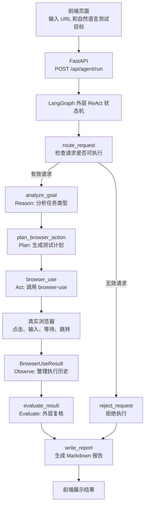
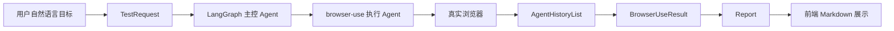
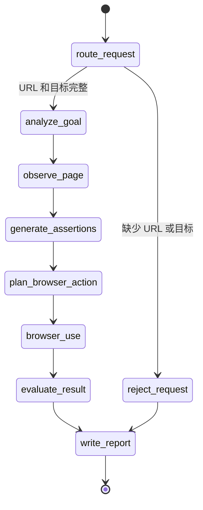
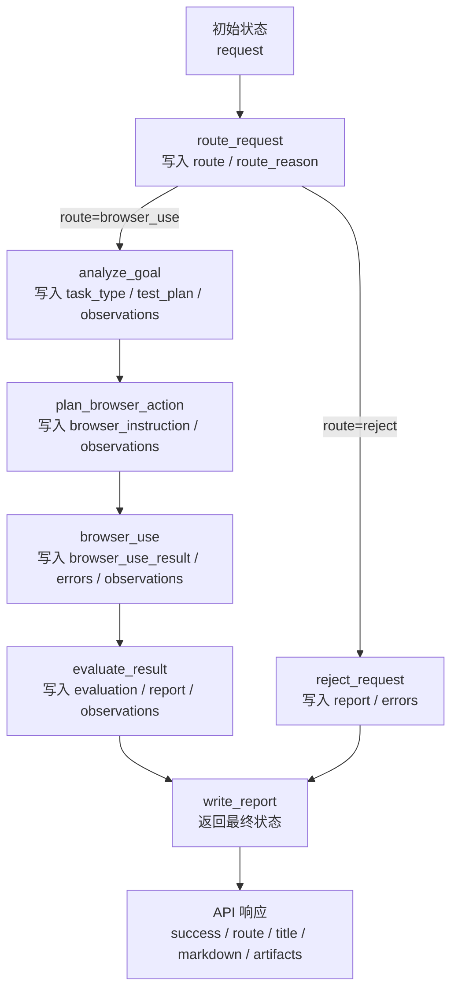

---
title: "LangGraph + browser-use：一个自然语言驱动的自动化测试 Agent 架构设计"
date: 2026-05-18
tags:
  - AI Agent
  - browser-use
  - LangGraph
  - 自动化测试
summary: "一个基于 LangGraph 外层状态机和 browser-use 浏览器执行引擎的自动化测试 Agent 设计，重点记录 Agent 框架、节点职责、路由逻辑、状态流转和工程化踩坑。"
---

# LangGraph + browser-use：一个自然语言驱动的自动化测试 Agent 架构设计

> 这篇文章记录一次自动化测试 Agent 的实践：用户在前端输入目标 URL 和自然语言测试目标，后端通过 LangGraph 做外层 ReAct 编排，再交给 browser-use 驱动真实浏览器完成测试，最后生成中文 Markdown 测试报告。

本文配图：

- 正文图 1：整体架构图
- 正文图 2：LangGraph ReAct 状态机图
- 正文图 3：一次登录测试成功后的 Markdown 报告截图，可以使用实际运行页面截图补充。

## 为什么想做这个 Agent

传统 Web 自动化测试通常依赖固定脚本。比如一个登录测试脚本可能长这样：

```python
await page.goto("https://example.com")
await page.click("text=Login")
await page.fill("input[type=email]", "user@example.com")
await page.fill("input[type=password]", "password")
await page.click("button[type=submit]")
```

这种方式稳定、可控，很适合固定业务流程。但如果用户每次都想输入不同目标，比如：

```text
测试登录功能
测试顶部导航栏是否能跳转
测试 Create Video 按钮是否正常
测试 Pricing 页面能不能打开
```

那系统就需要具备更强的 Agent 能力：理解目标、规划动作、操作浏览器、观察结果、生成报告。

我想做的是一个更接近“前端可接入”的自动化测试 Agent：用户不用写代码，只需要在页面输入自然语言目标，AI 自动理解页面并执行浏览器操作。

最终目标是：

```text
输入：目标 URL + 测试目标
执行：真实浏览器自动操作
输出：中文测试报告 + 执行轨迹 + 错误信息 + 截图路径
```

## 最终方案

最终我采用了：

```text
FastAPI 前端/API
  -> LangGraph 外层 ReAct 状态机
  -> browser-use 浏览器自动化 Agent
  -> Playwright/Chromium 真实浏览器
  -> Markdown 测试报告
```

整体架构如下：

![整体架构图](data:image/svg+xml;base64,PHN2ZyB4bWxucz0iaHR0cDovL3d3dy53My5vcmcvMjAwMC9zdmciIHdpZHRoPSIxNDQwIiBoZWlnaHQ9IjgyMCIgdmlld0JveD0iMCAwIDE0NDAgODIwIiByb2xlPSJpbWciIGFyaWEtbGFiZWxsZWRieT0idGl0bGUgZGVzYyI+CiAgPHRpdGxlIGlkPSJ0aXRsZSI+6Ieq5Yqo5YyW5rWL6K+VIEFnZW50IOaVtOS9k+aetuaehOWbvjwvdGl0bGU+CiAgPGRlc2MgaWQ9ImRlc2MiPuWxleekuuWJjeerr+OAgUZhc3RBUEnjgIFMYW5nR3JhcGjjgIHpobXpnaLlv6vnhafjgIHmlq3oqIDnlJ/miJDjgIFicm93c2VyLXVzZeOAgea1j+iniOWZqOaJp+ihjOWSjOa1i+ivleaKpeWRiueahOaVtOS9k+WFs+ezu+OAgjwvZGVzYz4KICA8ZGVmcz4KICAgIDxzdHlsZT4KICAgICAgLmJne2ZpbGw6I2Y2ZjhmYn0ubGFuZXtmaWxsOiNmZmY7c3Ryb2tlOiNkOGUwZWE7c3Ryb2tlLXdpZHRoOjJ9LmJveHtmaWxsOiNmZmY7c3Ryb2tlOiMxYjZmNjg7c3Ryb2tlLXdpZHRoOjIuNDtyeDoxMH0uYm94MntmaWxsOiNlZWY4ZjY7c3Ryb2tlOiMxYjZmNjg7c3Ryb2tlLXdpZHRoOjIuNDtyeDoxMH0uYm94M3tmaWxsOiNmZmY3ZTY7c3Ryb2tlOiNhODY3MDA7c3Ryb2tlLXdpZHRoOjIuNDtyeDoxMH0uYm94NHtmaWxsOiNmMGY0ZmY7c3Ryb2tlOiMzZjVmYmY7c3Ryb2tlLXdpZHRoOjIuNDtyeDoxMH0udGl0bGV7Zm9udDo3MDAgMzBweCAiTWljcm9zb2Z0IFlhSGVpIiwiUGluZ0ZhbmcgU0MiLEFyaWFsLHNhbnMtc2VyaWY7ZmlsbDojMTcyMDJhfS5sYW5lVGl0bGV7Zm9udDo3MDAgMThweCAiTWljcm9zb2Z0IFlhSGVpIiwiUGluZ0ZhbmcgU0MiLEFyaWFsLHNhbnMtc2VyaWY7ZmlsbDojNTk2NTc1fS50ZXh0e2ZvbnQ6NzAwIDE5cHggIk1pY3Jvc29mdCBZYUhlaSIsIlBpbmdGYW5nIFNDIixBcmlhbCxzYW5zLXNlcmlmO2ZpbGw6IzE3MjAyYX0uc3Vie2ZvbnQ6MTRweCAiTWljcm9zb2Z0IFlhSGVpIiwiUGluZ0ZhbmcgU0MiLEFyaWFsLHNhbnMtc2VyaWY7ZmlsbDojNTI2MDZkfS5hcnJvd3tzdHJva2U6IzFmMjkzNztzdHJva2Utd2lkdGg6Mi40O2ZpbGw6bm9uZTttYXJrZXItZW5kOnVybCgjYXJyb3doZWFkKX0uc29mdHtzdHJva2U6IzZiNzI4MDtzdHJva2Utd2lkdGg6MjtmaWxsOm5vbmU7bWFya2VyLWVuZDp1cmwoI3NvZnRoZWFkKTtzdHJva2UtZGFzaGFycmF5OjggNn0KICAgIDwvc3R5bGU+CiAgICA8bWFya2VyIGlkPSJhcnJvd2hlYWQiIG1hcmtlcldpZHRoPSIxMiIgbWFya2VySGVpZ2h0PSI4IiByZWZYPSIxMSIgcmVmWT0iNCIgb3JpZW50PSJhdXRvIj48cGF0aCBkPSJNMCwwIEwxMiw0IEwwLDggWiIgZmlsbD0iIzFmMjkzNyIvPjwvbWFya2VyPgogICAgPG1hcmtlciBpZD0ic29mdGhlYWQiIG1hcmtlcldpZHRoPSIxMiIgbWFya2VySGVpZ2h0PSI4IiByZWZYPSIxMSIgcmVmWT0iNCIgb3JpZW50PSJhdXRvIj48cGF0aCBkPSJNMCwwIEwxMiw0IEwwLDggWiIgZmlsbD0iIzZiNzI4MCIvPjwvbWFya2VyPgogIDwvZGVmcz4KCiAgPHJlY3QgY2xhc3M9ImJnIiB3aWR0aD0iMTQ0MCIgaGVpZ2h0PSI4MjAiLz4KICA8dGV4dCBjbGFzcz0idGl0bGUiIHg9IjY0IiB5PSI1OCI+6Ieq5Yqo5YyW5rWL6K+VIEFnZW50IOaVtOS9k+aetuaehDwvdGV4dD4KICA8dGV4dCBjbGFzcz0ic3ViIiB4PSI2NCIgeT0iODgiPuWJjeerr+i+k+WFpeiHqueEtuivreiogOebruagh++8jExhbmdHcmFwaCDlgZrlpJblsYIgUmVhc29uIC8gT2JzZXJ2ZSAvIEFzc2VydCAvIFBsYW4gLyBBY3QgLyBFdmFsdWF0ZSDnvJbmjpLvvIxicm93c2VyLXVzZSDpqbHliqjnnJ/lrp7mtY/op4jlmajmiafooYzjgII8L3RleHQ+CgogIDxyZWN0IGNsYXNzPSJsYW5lIiB4PSI0OCIgeT0iMTE4IiB3aWR0aD0iMTM0NCIgaGVpZ2h0PSIxMTIiIHJ4PSIxNCIvPgogIDx0ZXh0IGNsYXNzPSJsYW5lVGl0bGUiIHg9IjcyIiB5PSIxNTAiPuS6pOS6kuWxgjwvdGV4dD4KICA8cmVjdCBjbGFzcz0iYm94IiB4PSIxNzAiIHk9IjE1NCIgd2lkdGg9IjIzMCIgaGVpZ2h0PSI1OCIvPgogIDx0ZXh0IGNsYXNzPSJ0ZXh0IiB4PSIyMzgiIHk9IjE4MSI+5YmN56uv6aG16Z2iPC90ZXh0PgogIDx0ZXh0IGNsYXNzPSJzdWIiIHg9IjIxNCIgeT0iMjAyIj5VUkwgKyDoh6rnhLbor63oqIDnm67moIc8L3RleHQ+CiAgPHJlY3QgY2xhc3M9ImJveCIgeD0iNTkwIiB5PSIxNTQiIHdpZHRoPSIyMzAiIGhlaWdodD0iNTgiLz4KICA8dGV4dCBjbGFzcz0idGV4dCIgeD0iNjY2IiB5PSIxODEiPkZhc3RBUEk8L3RleHQ+CiAgPHRleHQgY2xhc3M9InN1YiIgeD0iNjMzIiB5PSIyMDIiPlBPU1QgL2FwaS9hZ2VudC9ydW48L3RleHQ+CiAgPHJlY3QgY2xhc3M9ImJveCIgeD0iMTAxMCIgeT0iMTU0IiB3aWR0aD0iMjMwIiBoZWlnaHQ9IjU4Ii8+CiAgPHRleHQgY2xhc3M9InRleHQiIHg9IjEwNzAiIHk9IjE4MSI+5pyN5Yqh5bGCPC90ZXh0PgogIDx0ZXh0IGNsYXNzPSJzdWIiIHg9IjEwNDgiIHk9IjIwMiI+5p6E6YCgIFRlc3RSZXF1ZXN0PC90ZXh0PgoKICA8cmVjdCBjbGFzcz0ibGFuZSIgeD0iNDgiIHk9IjI2MiIgd2lkdGg9IjEzNDQiIGhlaWdodD0iMjU4IiByeD0iMTQiLz4KICA8dGV4dCBjbGFzcz0ibGFuZVRpdGxlIiB4PSI3MiIgeT0iMjk0Ij7nvJbmjpLlsYLvvJpMYW5nR3JhcGgg5Li75o6nIEFnZW50PC90ZXh0PgogIDxyZWN0IGNsYXNzPSJib3gyIiB4PSI5NSIgeT0iMzIwIiB3aWR0aD0iMTkwIiBoZWlnaHQ9IjY2Ii8+CiAgPHRleHQgY2xhc3M9InRleHQiIHg9IjE0MCIgeT0iMzQ4Ij5SZWFzb248L3RleHQ+CiAgPHRleHQgY2xhc3M9InN1YiIgeD0iMTIxIiB5PSIzNzAiPmFuYWx5emVfZ29hbDwvdGV4dD4KICA8cmVjdCBjbGFzcz0iYm94MiIgeD0iMzI1IiB5PSIzMjAiIHdpZHRoPSIxOTAiIGhlaWdodD0iNjYiLz4KICA8dGV4dCBjbGFzcz0idGV4dCIgeD0iMzcxIiB5PSIzNDgiPk9ic2VydmU8L3RleHQ+CiAgPHRleHQgY2xhc3M9InN1YiIgeD0iMzYxIiB5PSIzNzAiPumhtemdouW/q+eFpzwvdGV4dD4KICA8cmVjdCBjbGFzcz0iYm94MiIgeD0iNTU1IiB5PSIzMjAiIHdpZHRoPSIxOTAiIGhlaWdodD0iNjYiLz4KICA8dGV4dCBjbGFzcz0idGV4dCIgeD0iNjA3IiB5PSIzNDgiPkFzc2VydDwvdGV4dD4KICA8dGV4dCBjbGFzcz0ic3ViIiB4PSI1OTEiIHk9IjM3MCI+55Sf5oiQ5pat6KiAPC90ZXh0PgogIDxyZWN0IGNsYXNzPSJib3gyIiB4PSI3ODUiIHk9IjMyMCIgd2lkdGg9IjE5MCIgaGVpZ2h0PSI2NiIvPgogIDx0ZXh0IGNsYXNzPSJ0ZXh0IiB4PSI4MzYiIHk9IjM0OCI+UGxhbjwvdGV4dD4KICA8dGV4dCBjbGFzcz0ic3ViIiB4PSI4MTAiIHk9IjM3MCI+55Sf5oiQ5omn6KGM5oyH5LukPC90ZXh0PgogIDxyZWN0IGNsYXNzPSJib3gyIiB4PSIxMDE1IiB5PSIzMjAiIHdpZHRoPSIxOTAiIGhlaWdodD0iNjYiLz4KICA8dGV4dCBjbGFzcz0idGV4dCIgeD0iMTA2OCIgeT0iMzQ4Ij5BY3Q8L3RleHQ+CiAgPHRleHQgY2xhc3M9InN1YiIgeD0iMTA1NiIgeT0iMzcwIj5icm93c2VyLXVzZTwvdGV4dD4KICA8cmVjdCBjbGFzcz0iYm94MiIgeD0iMTI0NSIgeT0iMzIwIiB3aWR0aD0iMTIwIiBoZWlnaHQ9IjY2Ii8+CiAgPHRleHQgY2xhc3M9InRleHQiIHg9IjEyNzIiIHk9IjM0OCI+RXZhbDwvdGV4dD4KICA8dGV4dCBjbGFzcz0ic3ViIiB4PSIxMjYwIiB5PSIzNzAiPuWkjeaguOe7k+aenDwvdGV4dD4KCiAgPHJlY3QgY2xhc3M9ImJveDQiIHg9IjMyNSIgeT0iNDIwIiB3aWR0aD0iNDIwIiBoZWlnaHQ9IjY2Ii8+CiAgPHRleHQgY2xhc3M9InRleHQiIHg9IjQ1OCIgeT0iNDQ4Ij5QYWdlU25hcHNob3Q8L3RleHQ+CiAgPHRleHQgY2xhc3M9InN1YiIgeD0iMzY1IiB5PSI0NzAiPuaIquWbviAvIOWPr+ingeaWh+acrCAvIOWPr+S6pOS6kuWFg+e0oCAvIGJib3ggLyBmb290ZXIg6ZO+5o6lPC90ZXh0PgogIDxyZWN0IGNsYXNzPSJib3g0IiB4PSI3ODUiIHk9IjQyMCIgd2lkdGg9IjQyMCIgaGVpZ2h0PSI2NiIvPgogIDx0ZXh0IGNsYXNzPSJ0ZXh0IiB4PSI5MDgiIHk9IjQ0OCI+VGVzdEFnZW50U3RhdGU8L3RleHQ+CiAgPHRleHQgY2xhc3M9InN1YiIgeD0iODMyIiB5PSI0NzAiPnJlcXVlc3QgLyBwbGFuIC8gYXNzZXJ0aW9ucyAvIG1lbW9yeSAvIHJlc3VsdCAvIHJlcG9ydDwvdGV4dD4KCiAgPHJlY3QgY2xhc3M9ImxhbmUiIHg9IjQ4IiB5PSI1NTIiIHdpZHRoPSIxMzQ0IiBoZWlnaHQ9IjEyMCIgcng9IjE0Ii8+CiAgPHRleHQgY2xhc3M9ImxhbmVUaXRsZSIgeD0iNzIiIHk9IjU4NCI+5omn6KGM5bGCPC90ZXh0PgogIDxyZWN0IGNsYXNzPSJib3gzIiB4PSIxNzAiIHk9IjU5NCIgd2lkdGg9IjIzMCIgaGVpZ2h0PSI1OCIvPgogIDx0ZXh0IGNsYXNzPSJ0ZXh0IiB4PSIyMzUiIHk9IjYyMSI+5qih5Z6LPC90ZXh0PgogIDx0ZXh0IGNsYXNzPSJzdWIiIHg9IjIyMCIgeT0iNjQyIj7op4bop4kgKyDnu5PmnoTljJbovpPlh7o8L3RleHQ+CiAgPHJlY3QgY2xhc3M9ImJveDMiIHg9IjU5MCIgeT0iNTk0IiB3aWR0aD0iMjMwIiBoZWlnaHQ9IjU4Ii8+CiAgPHRleHQgY2xhc3M9InRleHQiIHg9IjY0OSIgeT0iNjIxIj5icm93c2VyLXVzZTwvdGV4dD4KICA8dGV4dCBjbGFzcz0ic3ViIiB4PSI2MzIiIHk9IjY0MiI+5rWP6KeI5Zmo5omn6KGMIEFnZW50PC90ZXh0PgogIDxyZWN0IGNsYXNzPSJib3gzIiB4PSIxMDEwIiB5PSI1OTQiIHdpZHRoPSIyMzAiIGhlaWdodD0iNTgiLz4KICA8dGV4dCBjbGFzcz0idGV4dCIgeD0iMTA2OCIgeT0iNjIxIj7nnJ/lrp7mtY/op4jlmag8L3RleHQ+CiAgPHRleHQgY2xhc3M9InN1YiIgeD0iMTA1MCIgeT0iNjQyIj7ngrnlh7sgLyDovpPlhaUgLyDnrYnlvoUgLyDot7Povaw8L3RleHQ+CgogIDxyZWN0IGNsYXNzPSJib3giIHg9IjU5MCIgeT0iNzIwIiB3aWR0aD0iMjMwIiBoZWlnaHQ9IjU4Ii8+CiAgPHRleHQgY2xhc3M9InRleHQiIHg9IjY2MCIgeT0iNzQ3Ij7mtYvor5XmiqXlkYo8L3RleHQ+CiAgPHRleHQgY2xhc3M9InN1YiIgeD0iNjI2IiB5PSI3NjgiPk1hcmtkb3duICsg5Y6G5Y+y6K6w5b+GPC90ZXh0PgoKICA8cGF0aCBjbGFzcz0iYXJyb3ciIGQ9Ik00MDAgMTgzIEg1OTAiLz4KICA8cGF0aCBjbGFzcz0iYXJyb3ciIGQ9Ik04MjAgMTgzIEgxMDEwIi8+CiAgPHBhdGggY2xhc3M9ImFycm93IiBkPSJNMTEyNSAyMTIgVjMyMCIvPgogIDxwYXRoIGNsYXNzPSJhcnJvdyIgZD0iTTI4NSAzNTMgSDMyNSIvPgogIDxwYXRoIGNsYXNzPSJhcnJvdyIgZD0iTTUxNSAzNTMgSDU1NSIvPgogIDxwYXRoIGNsYXNzPSJhcnJvdyIgZD0iTTc0NSAzNTMgSDc4NSIvPgogIDxwYXRoIGNsYXNzPSJhcnJvdyIgZD0iTTk3NSAzNTMgSDEwMTUiLz4KICA8cGF0aCBjbGFzcz0iYXJyb3ciIGQ9Ik0xMjA1IDM1MyBIMTI0NSIvPgogIDxwYXRoIGNsYXNzPSJzb2Z0IiBkPSJNNDIwIDM4NiBWNDIwIi8+CiAgPHBhdGggY2xhc3M9InNvZnQiIGQ9Ik05OTUgMzg2IFY0MjAiLz4KICA8cGF0aCBjbGFzcz0iYXJyb3ciIGQ9Ik0xMTEwIDM4NiBDMTExMCA1MDUgNzA1IDUwNSA3MDUgNTk0Ii8+CiAgPHBhdGggY2xhc3M9ImFycm93IiBkPSJNNDAwIDYyMyBINTkwIi8+CiAgPHBhdGggY2xhc3M9ImFycm93IiBkPSJNODIwIDYyMyBIMTAxMCIvPgogIDxwYXRoIGNsYXNzPSJhcnJvdyIgZD0iTTExMjUgNjUyIEMxMTI1IDcyNSA4ODAgNzQ5IDgyMCA3NDkiLz4KICA8cGF0aCBjbGFzcz0ic29mdCIgZD0iTTcwNSA3MjAgVjY1MiIvPgo8L3N2Zz4K)



这里有一个关键设计：我没有让 LangGraph 直接操作浏览器，而是把它作为外层状态机。

LangGraph 负责：

- 判断请求是否合法
- 分析用户目标
- 生成测试计划
- 调用 browser-use
- 复核 browser-use 的结果
- 输出最终报告

browser-use 负责：

- 打开浏览器
- 观察页面
- 识别按钮、输入框、弹窗、链接
- 执行点击、输入、等待、跳转
- 汇总真实执行结果

这样职责比较清晰。外层 Agent 负责“测试流程”，内层 browser-use 负责“浏览器操作”。

## Agent 框架设计

这个 Agent 分成四层：

```text
交互层：FastAPI + 前端页面
编排层：LangGraph 外层状态机
执行层：browser-use Agent
模型层：OpenAI/Ark 兼容模型
```

每一层只做自己该做的事。

| 层级  | 主要职责                                      | 对应文件                                                      |
| --- | ----------------------------------------- | --------------------------------------------------------- |
| 交互层 | 接收 URL、自然语言目标、超时、有头模式等参数，并展示报告            | `test_agent/web_app.py`                                   |
| 服务层 | 把前端请求转换成内部 `TestRequest`，调用 LangGraph     | `test_agent/agent_service.py`                             |
| 编排层 | 通过节点和路由控制 Agent 流程                        | `test_agent/graph/builder.py`、`test_agent/graph/nodes.py` |
| 执行层 | 调用 browser-use 打开浏览器、观察页面、执行动作            | `test_agent/browser_use_runner.py`                        |
| 状态层 | 定义请求、结果、报告和全局状态结构                         | `test_agent/models.py`                                    |
| 配置层 | 管理模型配置、browser-use 工作目录、LangSmith tracing | `test_agent/settings.py`                                  |

从职责上看，LangGraph 是“主控 Agent”，browser-use 是“浏览器执行 Agent”。主控 Agent 不直接点击页面，而是负责把任务拆清楚、把状态传下去、把结果收回来。



## 状态模型

状态机里最重要的是 `TestAgentState`。它是所有节点之间传递的任务单。

```python
class TestAgentState(TypedDict):
    request: TestRequest
    route: Literal["browser_use", "reject"]
    route_reason: str
    task_type: str
    test_plan: list[str]
    browser_instruction: str
    memories: list[str]
    observations: list[str]
    evaluation: str
    browser_use_result: BrowserUseResult
    report: Report
    errors: list[str]
```

这个状态对象里有几类信息：

| 字段                    | 类型   | 作用                             |
| --------------------- | ---- | ------------------------------ |
| `request`             | 输入   | 用户传入的 URL、测试目标、浏览器配置           |
| `route`               | 路由   | 决定后续走 browser-use 还是 reject    |
| `route_reason`        | 路由说明 | 记录为什么选择这条路                     |
| `task_type`           | 任务分析 | 登录、导航、表单、通用页面行为等               |
| `test_plan`           | 计划   | 外层 Agent 生成的测试步骤               |
| `browser_instruction` | 执行指令 | 传给 browser-use 的完整任务说明         |
| `memories`            | 历史记忆 | 同域名过往成功经验和失败经验                 |
| `observations`        | 观察轨迹 | 记录 Reason、Plan、Act、Evaluate 过程 |
| `evaluation`          | 外层评估 | 对 browser-use 执行结果的复核          |
| `browser_use_result`  | 执行结果 | browser-use 返回并规整后的结果          |
| `report`              | 输出   | 最终给前端展示的 Markdown 报告           |
| `errors`              | 错误   | 外层流程捕获到的问题                     |

这里的设计重点是：每个节点只改自己负责的字段。

比如 `analyze_goal` 只负责写入 `task_type` 和 `test_plan`；`browser_use` 只负责写入 `browser_use_result`；`evaluate_result` 只负责写入 `evaluation`。

这种状态设计会让后续扩展更容易。比如要增加“失败重试”，只需要在状态里增加 `retry_count`，再在 `evaluate_result` 后加一个条件路由。

## 测试历史与记忆

我给这个 Agent 加了一层轻量记忆机制。

它不依赖数据库，而是先用本地文件存储：

```text
artifacts/test_history/history.jsonl
artifacts/test_history/memory.json
```

其中：

| 文件              | 作用                 |
| --------------- | ------------------ |
| `history.jsonl` | 记录每一次测试运行          |
| `memory.json`   | 按域名沉淀可复用的成功经验和失败经验 |

每次测试结束后，系统会保存一条历史：

```text
运行 ID
执行时间
目标 URL
测试目标
任务类型
是否成功
执行步数
耗时
最终 URL
错误信息
截图路径
外层评估
Markdown 报告
```

同时会把这次运行压缩成一条记忆。

成功时类似：

```text
历史成功经验：登录/认证测试可执行；最终 URL：...
```

失败时类似：

```text
历史失败经验：导航/跳转巡检曾失败；优先规避相同问题：...
```

下次再测试同一个域名时，`load_memories` 会把这些记忆读出来，注入到 `plan_browser_action` 生成的 browser-use 指令里：

```text
同域名历史记忆：
- 历史成功经验：...
- 历史失败经验：...
```

这让 Agent 从“一次性执行”变成“带一点站点经验的执行”。它还不是长期记忆系统，但已经能做到同域名历史复用。

前端也加了最近测试历史：

```text
展示最近 10 条测试记录
点击历史记录可以回填 URL 和测试目标
运行完成后自动刷新历史列表
```

因为测试目标里可能包含账号、密码或 token，所以保存历史前会做脱敏：

```text
邮箱 -> <email>
密码 / token / api_key / secret -> <redacted>
```

## 节点设计

当前状态机不是只有“执行”和“拒绝”两条路，而是增加了外层 ReAct 逻辑。

![LangGraph ReAct 状态机图](data:image/svg+xml;base64,PHN2ZyB4bWxucz0iaHR0cDovL3d3dy53My5vcmcvMjAwMC9zdmciIHdpZHRoPSIxMjgwIiBoZWlnaHQ9Ijk4MCIgdmlld0JveD0iMCAwIDEyODAgOTgwIiByb2xlPSJpbWciIGFyaWEtbGFiZWxsZWRieT0idGl0bGUgZGVzYyI+CiAgPHRpdGxlIGlkPSJ0aXRsZSI+TGFuZ0dyYXBoIFJlQWN0IOeKtuaAgeacuua1gei9rOWbvjwvdGl0bGU+CiAgPGRlc2MgaWQ9ImRlc2MiPuWxleekuiByb3V0ZV9yZXF1ZXN044CBYW5hbHl6ZV9nb2Fs44CBb2JzZXJ2ZV9wYWdl44CBZ2VuZXJhdGVfYXNzZXJ0aW9uc+OAgXBsYW5fYnJvd3Nlcl9hY3Rpb27jgIFicm93c2VyX3VzZeOAgWV2YWx1YXRlX3Jlc3VsdOOAgXJlamVjdF9yZXF1ZXN0IOWSjCB3cml0ZV9yZXBvcnQg55qE54q25oCB5rWB6L2s44CCPC9kZXNjPgogIDxkZWZzPgogICAgPHN0eWxlPgogICAgICAuYmd7ZmlsbDojZjdmOGZifS50aXRsZXtmb250OjcwMCAzMHB4ICJNaWNyb3NvZnQgWWFIZWkiLCJQaW5nRmFuZyBTQyIsQXJpYWwsc2Fucy1zZXJpZjtmaWxsOiMxNzIwMmF9LnN1Yntmb250OjE1cHggIk1pY3Jvc29mdCBZYUhlaSIsIlBpbmdGYW5nIFNDIixBcmlhbCxzYW5zLXNlcmlmO2ZpbGw6IzUyNjA2ZH0ubm9kZXtmaWxsOiNmZmY7c3Ryb2tlOiMxYjZmNjg7c3Ryb2tlLXdpZHRoOjIuNDtyeDoxMn0ubm9kZUFjY2VudHtmaWxsOiNlZWY4ZjY7c3Ryb2tlOiMxYjZmNjg7c3Ryb2tlLXdpZHRoOjIuNDtyeDoxMn0ubm9kZVdhcm57ZmlsbDojZmZmNGU2O3N0cm9rZTojYTg2NzAwO3N0cm9rZS13aWR0aDoyLjQ7cng6MTJ9Lm5vZGVFbmR7ZmlsbDojZjBmNGZmO3N0cm9rZTojM2Y1ZmJmO3N0cm9rZS13aWR0aDoyLjQ7cng6MTJ9LmxhYmVse2ZvbnQ6NzAwIDE4cHggIk1pY3Jvc29mdCBZYUhlaSIsIlBpbmdGYW5nIFNDIixBcmlhbCxzYW5zLXNlcmlmO2ZpbGw6IzE3MjAyYX0ucm9sZXtmb250OjcwMCAxNHB4ICJNaWNyb3NvZnQgWWFIZWkiLCJQaW5nRmFuZyBTQyIsQXJpYWwsc2Fucy1zZXJpZjtmaWxsOiMxYjZmNjh9LnNtYWxse2ZvbnQ6MTRweCAiTWljcm9zb2Z0IFlhSGVpIiwiUGluZ0ZhbmcgU0MiLEFyaWFsLHNhbnMtc2VyaWY7ZmlsbDojNTI2MDZkfS5lZGdle3N0cm9rZTojMWYyOTM3O3N0cm9rZS13aWR0aDoyLjQ7ZmlsbDpub25lO21hcmtlci1lbmQ6dXJsKCNhcnJvd2hlYWQpfS5yZWplY3R7c3Ryb2tlOiNhODY3MDA7c3Ryb2tlLXdpZHRoOjIuNDtmaWxsOm5vbmU7bWFya2VyLWVuZDp1cmwoI2Fycm93aGVhZFdhcm4pfS5ub3Rle2ZpbGw6I2ZmZjtzdHJva2U6I2Q4ZTBlYTtzdHJva2Utd2lkdGg6MS44O3J4OjEwfQogICAgPC9zdHlsZT4KICAgIDxtYXJrZXIgaWQ9ImFycm93aGVhZCIgbWFya2VyV2lkdGg9IjEyIiBtYXJrZXJIZWlnaHQ9IjgiIHJlZlg9IjExIiByZWZZPSI0IiBvcmllbnQ9ImF1dG8iPjxwYXRoIGQ9Ik0wLDAgTDEyLDQgTDAsOCBaIiBmaWxsPSIjMWYyOTM3Ii8+PC9tYXJrZXI+CiAgICA8bWFya2VyIGlkPSJhcnJvd2hlYWRXYXJuIiBtYXJrZXJXaWR0aD0iMTIiIG1hcmtlckhlaWdodD0iOCIgcmVmWD0iMTEiIHJlZlk9IjQiIG9yaWVudD0iYXV0byI+PHBhdGggZD0iTTAsMCBMMTIsNCBMMCw4IFoiIGZpbGw9IiNhODY3MDAiLz48L21hcmtlcj4KICA8L2RlZnM+CgogIDxyZWN0IGNsYXNzPSJiZyIgd2lkdGg9IjEyODAiIGhlaWdodD0iOTgwIi8+CiAgPHRleHQgY2xhc3M9InRpdGxlIiB4PSI2NCIgeT0iNTgiPkxhbmdHcmFwaCBSZUFjdCDnirbmgIHmnLrmtYHovazlm748L3RleHQ+CiAgPHRleHQgY2xhc3M9InN1YiIgeD0iNjQiIHk9Ijg4Ij7mnInmlYjor7fmsYLov5vlhaUgUmVhc29uIC0+IE9ic2VydmUgLT4gQXNzZXJ0IC0+IFBsYW4gLT4gQWN0IC0+IEV2YWx1YXRlIOS4u+i3r+W+hO+8m+aXoOaViOivt+axgui/m+WFpSByZWplY3RfcmVxdWVzdCDlronlhajlh7rlj6PjgII8L3RleHQ+CgogIDxyZWN0IGNsYXNzPSJub2RlRW5kIiB4PSI1MjAiIHk9IjEyNSIgd2lkdGg9IjIyMCIgaGVpZ2h0PSI3OCIvPgogIDx0ZXh0IGNsYXNzPSJsYWJlbCIgeD0iNjAzIiB5PSIxNTgiPlNUQVJUPC90ZXh0PgogIDx0ZXh0IGNsYXNzPSJzbWFsbCIgeD0iNTc5IiB5PSIxODEiPuWIneWniyBUZXN0QWdlbnRTdGF0ZTwvdGV4dD4KCiAgPHJlY3QgY2xhc3M9Im5vZGUiIHg9IjUwMCIgeT0iMjM1IiB3aWR0aD0iMjYwIiBoZWlnaHQ9Ijg4Ii8+CiAgPHRleHQgY2xhc3M9InJvbGUiIHg9IjUyOCIgeT0iMjY0Ij5Sb3V0ZTwvdGV4dD4KICA8dGV4dCBjbGFzcz0ibGFiZWwiIHg9IjU2NiIgeT0iMjkwIj5yb3V0ZV9yZXF1ZXN0PC90ZXh0PgogIDx0ZXh0IGNsYXNzPSJzbWFsbCIgeD0iNTQxIiB5PSIzMTEiPuajgOafpeivt+axguaYr+WQpuWPr+aJp+ihjDwvdGV4dD4KCiAgPHJlY3QgY2xhc3M9Im5vZGVBY2NlbnQiIHg9IjUwMCIgeT0iMzY1IiB3aWR0aD0iMjYwIiBoZWlnaHQ9Ijg4Ii8+CiAgPHRleHQgY2xhc3M9InJvbGUiIHg9IjUyOCIgeT0iMzk0Ij5SZWFzb248L3RleHQ+CiAgPHRleHQgY2xhc3M9ImxhYmVsIiB4PSI1NzAiIHk9IjQyMCI+YW5hbHl6ZV9nb2FsPC90ZXh0PgogIDx0ZXh0IGNsYXNzPSJzbWFsbCIgeD0iNTQwIiB5PSI0NDEiPuWIhuaekOS7u+WKoeexu+Wei+WSjOWIneWni+iuoeWIkjwvdGV4dD4KCiAgPHJlY3QgY2xhc3M9Im5vZGVBY2NlbnQiIHg9IjUwMCIgeT0iNDk1IiB3aWR0aD0iMjYwIiBoZWlnaHQ9Ijg4Ii8+CiAgPHRleHQgY2xhc3M9InJvbGUiIHg9IjUyOCIgeT0iNTI0Ij5PYnNlcnZlPC90ZXh0PgogIDx0ZXh0IGNsYXNzPSJsYWJlbCIgeD0iNTc3IiB5PSI1NTAiPm9ic2VydmVfcGFnZTwvdGV4dD4KICA8dGV4dCBjbGFzcz0ic21hbGwiIHg9IjUzNSIgeT0iNTcxIj7nlJ/miJDpobXpnaLlv6vnhacgLyDmiKrlm74gLyDlhYPntKA8L3RleHQ+CgogIDxyZWN0IGNsYXNzPSJub2RlQWNjZW50IiB4PSI1MDAiIHk9IjYyNSIgd2lkdGg9IjI2MCIgaGVpZ2h0PSI4OCIvPgogIDx0ZXh0IGNsYXNzPSJyb2xlIiB4PSI1MjgiIHk9IjY1NCI+QXNzZXJ0PC90ZXh0PgogIDx0ZXh0IGNsYXNzPSJsYWJlbCIgeD0iNTQzIiB5PSI2ODAiPmdlbmVyYXRlX2Fzc2VydGlvbnM8L3RleHQ+CiAgPHRleHQgY2xhc3M9InNtYWxsIiB4PSI1NDgiIHk9IjcwMSI+55Sf5oiQ5Y+v6aqM6K+B5pat6KiA5qCH5YeGPC90ZXh0PgoKICA8cmVjdCBjbGFzcz0ibm9kZUFjY2VudCIgeD0iNTAwIiB5PSI3NTUiIHdpZHRoPSIyNjAiIGhlaWdodD0iODgiLz4KICA8dGV4dCBjbGFzcz0icm9sZSIgeD0iNTI4IiB5PSI3ODQiPlBsYW48L3RleHQ+CiAgPHRleHQgY2xhc3M9ImxhYmVsIiB4PSI1MzYiIHk9IjgxMCI+cGxhbl9icm93c2VyX2FjdGlvbjwvdGV4dD4KICA8dGV4dCBjbGFzcz0ic21hbGwiIHg9IjU1MCIgeT0iODMxIj7nlJ/miJAgYnJvd3Nlci11c2Ug5oyH5LukPC90ZXh0PgoKICA8cmVjdCBjbGFzcz0ibm9kZUFjY2VudCIgeD0iODY1IiB5PSI3NTUiIHdpZHRoPSIyNDAiIGhlaWdodD0iODgiLz4KICA8dGV4dCBjbGFzcz0icm9sZSIgeD0iODkzIiB5PSI3ODQiPkFjdDwvdGV4dD4KICA8dGV4dCBjbGFzcz0ibGFiZWwiIHg9IjkzMiIgeT0iODEwIj5icm93c2VyX3VzZTwvdGV4dD4KICA8dGV4dCBjbGFzcz0ic21hbGwiIHg9IjkwNyIgeT0iODMxIj7osIPnlKggYnJvd3Nlci11c2Ug5omn6KGMPC90ZXh0PgoKICA8cmVjdCBjbGFzcz0ibm9kZUFjY2VudCIgeD0iODY1IiB5PSI2MjUiIHdpZHRoPSIyNDAiIGhlaWdodD0iODgiLz4KICA8dGV4dCBjbGFzcz0icm9sZSIgeD0iODkzIiB5PSI2NTQiPkV2YWx1YXRlPC90ZXh0PgogIDx0ZXh0IGNsYXNzPSJsYWJlbCIgeD0iOTIwIiB5PSI2ODAiPmV2YWx1YXRlX3Jlc3VsdDwvdGV4dD4KICA8dGV4dCBjbGFzcz0ic21hbGwiIHg9IjkxNCIgeT0iNzAxIj7lpI3moLjnu5PmnpzlubbnlJ/miJDnu5Porro8L3RleHQ+CgogIDxyZWN0IGNsYXNzPSJub2RlV2FybiIgeD0iODY1IiB5PSIzNjUiIHdpZHRoPSIyNDAiIGhlaWdodD0iODgiLz4KICA8dGV4dCBjbGFzcz0icm9sZSIgeD0iODkzIiB5PSIzOTQiIGZpbGw9IiNhODY3MDAiPlJlamVjdDwvdGV4dD4KICA8dGV4dCBjbGFzcz0ibGFiZWwiIHg9IjkyMyIgeT0iNDIwIj5yZWplY3RfcmVxdWVzdDwvdGV4dD4KICA8dGV4dCBjbGFzcz0ic21hbGwiIHg9IjkxNSIgeT0iNDQxIj7ml6DmlYjor7fmsYLlronlhajlh7rlj6M8L3RleHQ+CgogIDxyZWN0IGNsYXNzPSJub2RlRW5kIiB4PSI1MDAiIHk9Ijg4MCIgd2lkdGg9IjI2MCIgaGVpZ2h0PSI3OCIvPgogIDx0ZXh0IGNsYXNzPSJyb2xlIiB4PSI1MjgiIHk9IjkwOCI+UmVwb3J0PC90ZXh0PgogIDx0ZXh0IGNsYXNzPSJsYWJlbCIgeD0iNTc0IiB5PSI5MzIiPndyaXRlX3JlcG9ydDwvdGV4dD4KICA8dGV4dCBjbGFzcz0ic21hbGwiIHg9IjU2MiIgeT0iOTUyIj7nlJ/miJAgTWFya2Rvd24g5oql5ZGKPC90ZXh0PgoKICA8cmVjdCBjbGFzcz0ibm90ZSIgeD0iODAiIHk9IjUwMCIgd2lkdGg9IjMxMCIgaGVpZ2h0PSIxMzAiLz4KICA8dGV4dCBjbGFzcz0ibGFiZWwiIHg9IjEwNSIgeT0iNTMwIj5QYWdlU25hcHNob3Q8L3RleHQ+CiAgPHRleHQgY2xhc3M9InNtYWxsIiB4PSIxMDUiIHk9IjU1NiI+5oiq5Zu+IC8gdmlld3BvcnQgLyBzY3JvbGw8L3RleHQ+CiAgPHRleHQgY2xhc3M9InNtYWxsIiB4PSIxMDUiIHk9IjU4MCI+5Y+v6KeB5paH5pysIC8g5Y+v5Lqk5LqS5YWD57SgPC90ZXh0PgogIDx0ZXh0IGNsYXNzPSJzbWFsbCIgeD0iMTA1IiB5PSI2MDQiPnJvbGUgLyBocmVmIC8gYmJveCAvIGZvb3RlciBsaW5rczwvdGV4dD4KCiAgPHJlY3QgY2xhc3M9Im5vdGUiIHg9IjgwIiB5PSI2NjAiIHdpZHRoPSIzMTAiIGhlaWdodD0iMTEwIi8+CiAgPHRleHQgY2xhc3M9ImxhYmVsIiB4PSIxMDUiIHk9IjY5MCI+QXNzZXJ0aW9uczwvdGV4dD4KICA8dGV4dCBjbGFzcz0ic21hbGwiIHg9IjEwNSIgeT0iNzE2Ij5VUkwgLyB0aXRsZSAvIHRleHQg5Y+Y5YyWPC90ZXh0PgogIDx0ZXh0IGNsYXNzPSJzbWFsbCIgeD0iMTA1IiB5PSI3NDAiPuaXoCA0MDQgLyBlcnJvciAvIGJsYW5rIHBhZ2U8L3RleHQ+CgogIDxwYXRoIGNsYXNzPSJlZGdlIiBkPSJNNjMwIDIwMyBWMjM1Ii8+CiAgPHBhdGggY2xhc3M9ImVkZ2UiIGQ9Ik02MzAgMzIzIFYzNjUiLz4KICA8cGF0aCBjbGFzcz0iZWRnZSIgZD0iTTYzMCA0NTMgVjQ5NSIvPgogIDxwYXRoIGNsYXNzPSJlZGdlIiBkPSJNNjMwIDU4MyBWNjI1Ii8+CiAgPHBhdGggY2xhc3M9ImVkZ2UiIGQ9Ik02MzAgNzEzIFY3NTUiLz4KICA8cGF0aCBjbGFzcz0iZWRnZSIgZD0iTTc2MCA3OTkgSDg2NSIvPgogIDxwYXRoIGNsYXNzPSJlZGdlIiBkPSJNOTg1IDc1NSBWNzEzIi8+CiAgPHBhdGggY2xhc3M9ImVkZ2UiIGQ9Ik04NjUgNjY5IEg3NjAiLz4KICA8cGF0aCBjbGFzcz0iZWRnZSIgZD0iTTYzMCA4NDMgVjg4MCIvPgoKICA8cGF0aCBjbGFzcz0icmVqZWN0IiBkPSJNNzYwIDI3OSBDOTMwIDI3OSA5ODUgMzEwIDk4NSAzNjUiLz4KICA8cGF0aCBjbGFzcz0icmVqZWN0IiBkPSJNOTg1IDQ1MyBDOTg1IDgzMCA3NjAgODMwIDc2MCA5MTkiLz4KCiAgPHBhdGggY2xhc3M9ImVkZ2UiIGQ9Ik01MDAgNTM5IEgzOTAiLz4KICA8cGF0aCBjbGFzcz0iZWRnZSIgZD0iTTUwMCA2NjkgSDM5MCIvPgoKICA8dGV4dCBjbGFzcz0ic21hbGwiIHg9Ijc4NSIgeT0iMjY1Ij5yb3V0ZT1yZWplY3Q8L3RleHQ+CiAgPHRleHQgY2xhc3M9InNtYWxsIiB4PSI2NjAiIHk9IjM0NyI+cm91dGU9YnJvd3Nlcl91c2U8L3RleHQ+CiAgPHRleHQgY2xhc3M9InNtYWxsIiB4PSI3ODUiIHk9Ijc4NiI+YnJvd3Nlcl9pbnN0cnVjdGlvbjwvdGV4dD4KICA8dGV4dCBjbGFzcz0ic21hbGwiIHg9Ijc5MCIgeT0iNjUzIj5Ccm93c2VyVXNlUmVzdWx0PC90ZXh0Pgo8L3N2Zz4K)



各节点职责如下：

| 节点                    | ReAct 角色         | 作用                          |
| --------------------- | ---------------- | --------------------------- |
| `route_request`       | Route            | 检查 URL 和测试目标是否完整            |
| `analyze_goal`        | Reason           | 判断任务类型，例如登录、导航、表单、通用页面行为    |
| `observe_page`        | Observe          | 计划前生成页面快照：截图、文本、可交互元素、候选链接  |
| `generate_assertions` | Assert           | 根据任务目标和页面快照生成可验证标准          |
| `plan_browser_action` | Plan             | 生成面向 browser-use 的测试计划和执行指令 |
| `browser_use`         | Act              | 调用 browser-use 执行真实浏览器操作    |
| `evaluate_result`     | Observe/Evaluate | 根据执行结果做外层复核                 |
| `reject_request`      | Reject           | 请求不完整时拒绝执行                  |
| `write_report`        | Report           | 输出最终 Markdown 报告            |

这层 ReAct 的价值在于：报告不再只是“成功/失败”，而是能看到 Agent 是怎么理解任务、怎么计划执行、最后怎么判断结果的。

### route_request：入口路由节点

`route_request` 是整个状态机的入口节点。它不做页面操作，只做请求校验。

它关注两个字段：

```text
request.base_url
request.goal
```

如果 URL 或测试目标为空，就把状态写成：

```text
route = "reject"
route_reason = "缺少目标 URL 或自然语言测试目标。"
```

如果请求完整，就写成：

```text
route = "browser_use"
route_reason = "请求有效，交给 browser-use 执行。"
```

这个节点的意义是把“请求能不能执行”这件事前置，避免无效任务进入后面的分析和浏览器执行阶段。

### analyze_goal：任务分析节点

`analyze_goal` 是 Reason 节点。它会读取用户的自然语言目标，并判断任务类型。

当前内置了几类任务：

| 任务类型     | 触发关键词示例                 | 生成的测试计划方向               |
| -------- | ----------------------- | ----------------------- |
| 登录/认证测试  | 登录、登陆、login、sign in     | 找登录入口、输入凭证、提交、判断登录态     |
| 导航/跳转巡检  | 导航、顶部、跳转、链接、nav、menu    | 找导航区域、逐个点击、检查 URL 和页面内容 |
| 表单/输入测试  | 表单、提交、输入、搜索、form、search | 找输入区域、填写字段、提交、观察反馈      |
| 通用页面行为测试 | 其他目标                    | 根据页面结构和用户目标自由规划         |

这个节点会写入：

```text
task_type
test_plan
observations
```

比如用户输入：

```text
测试一下这个页面的登录功能
```

节点会生成：

```text
task_type = "登录/认证测试"

test_plan = [
  "打开目标页面并等待首屏加载完成。",
  "识别登录入口，必要时处理弹窗、菜单或跳转。",
  "根据用户提供的凭证填写账号和密码。",
  "提交登录表单并等待页面状态变化。",
  "观察登录后页面、头像、按钮、弹窗或 URL 变化，判断是否登录成功。"
]
```

### observe_page：计划前页面快照节点

`observe_page` 是新增的 Observe 节点。它位于 `analyze_goal` 和 `plan_browser_action` 之间。

这个节点会先用一个轻量浏览器打开目标页面，生成计划前页面快照：

```text
打开目标 URL
必要时滚动到底部
截取当前页面截图
提取页面标题和当前 URL
提取 viewport 和 scroll 信息
提取可见文本摘要
提取按钮、输入框、select、textarea 等可交互元素
提取元素 role、aria-label、placeholder、href、bbox
提取页面候选链接
提取 footer 或疑似底部区域链接
```

它会写入：

```text
page_snapshot
observations
```

这样后续 `plan_browser_action` 生成测试计划时，不再只依赖用户输入和历史记忆，还会参考当前页面结构快照。

例如底部导航测试会拿到：

```text
页面链接总数
疑似页脚链接数
候选链接文本
候选链接 URL
可交互元素列表
元素位置 bbox
页面快照截图路径
```

然后 browser-use 执行时，会同时参考：

```text
用户目标
历史记忆
页面快照、可见文本、候选链接和可交互元素摘要
外层 ReAct 测试计划
实时浏览器观察
```

### generate_assertions：断言生成节点

`generate_assertions` 是 Assert 节点，位于页面快照之后、执行计划之前。

它的目标是把用户的自然语言测试目标变成更硬的验证标准。例如底部导航链接测试不再只说“检查是否正常”，而是生成：

```text
每个被测链接点击前必须记录链接文本和目标 href。
每个被测链接点击后，URL、页面标题或主内容至少有一项发生符合预期的变化。
页面不能出现 404、Not Found、Error、空白页或明显加载失败。
如果链接进入登录页、应用页或外部页面，只要页面可达且无错误页，应记录为可达而不是直接判失败。
```

断言节点会写入：

```text
assertions
observations
```

后续 `plan_browser_action` 会把这些断言一起传给 browser-use，要求它在最终报告里逐条说明通过、失败或不确定。

### plan_browser_action：执行计划节点

`plan_browser_action` 是 Plan 节点。它不会打开浏览器，而是把前面分析出来的任务类型和测试计划，整理成一段更适合 browser-use 执行的指令。

这个节点会写入：

```text
browser_instruction
observations
```

`browser_instruction` 里包含：

```text
目标页面
任务类型
用户原始测试目标
外层 ReAct 测试计划
执行要求
输出约束
```

其中有一条很重要：

```text
必须遵守 browser-use 系统要求的 AgentOutput JSON 格式；
不要在 JSON 外输出普通文本。
```

这是为了减少模型直接输出中文总结导致 `AgentOutput Invalid JSON` 的概率。

### browser_use：浏览器执行节点

`browser_use` 是 Act 节点。它会把 `browser_instruction` 放回 `TestRequest.goal`，再交给 browser-use。

它负责写入：

```text
browser_use_result
report
observations
errors
```

browser-use 内部会完成更细的循环：

```text
观察页面
决定下一步动作
点击 / 输入 / 等待 / 跳转
再次观察
判断是否完成
```

外层 LangGraph 不需要知道每一个 DOM 操作细节，只需要拿回 browser-use 的执行历史和最终结果。

### evaluate_result：外层评估节点

`evaluate_result` 是 Observe/Evaluate 节点。它读取 `browser_use_result`，做一次保守复核。

当前规则是：

| browser-use 结果          | 外层评估      |
| ----------------------- | --------- |
| `success=True`          | 通过        |
| 有 `errors`              | 失败        |
| 有 `final_result` 但未明确成功 | 失败，需要人工复核 |
| 没有有效结果                  | 失败        |

这个节点会写入：

```text
evaluation
observations
report
```

它的作用不是替代 browser-use 判断，而是让外层报告里有一个稳定、可解释的最终复核结论。

### reject_request：拒绝节点

`reject_request` 是安全出口。当请求缺少 URL 或测试目标时，状态机会走到这里。

它会直接生成失败报告：

```text
# 测试请求已拒绝

缺少目标 URL 或自然语言测试目标。
```

这个节点保证无效请求不会进入模型调用和浏览器执行阶段。

### write_report：报告出口节点

`write_report` 是最终出口节点。它不再改变业务结果，只负责作为状态机的收口。

所有路径最终都会走到它：

```text
成功执行路径 -> write_report
拒绝执行路径 -> write_report
执行失败路径 -> write_report
```

## 路由设计

节点负责“干活”，路由负责“决定下一步去哪”。

当前条件路由函数很薄：

```python
def route_after_router(state: TestAgentState) -> Literal["browser_use", "reject"]:
    return state["route"]
```

它只读取 `route_request` 写入的 `state["route"]`。

对应的边定义是：

```python
graph.add_conditional_edges(
    "route_request",
    route_after_router,
    {
        "browser_use": "analyze_goal",
        "reject": "reject_request",
    },
)
```

也就是说：

```text
route = browser_use  -> analyze_goal
route = reject       -> reject_request
```

这里有一个小细节：路由名字叫 `browser_use`，但它并不是直接跳到 `browser_use` 节点，而是先跳到 `analyze_goal`。因为 `browser_use` 在这里表示“这是一个可执行的浏览器测试请求”，真正执行前还需要经过 Reason 和 Plan。

完整边定义可以理解成：

```text
START
  -> route_request
  -> 条件路由
      -> analyze_goal
      -> plan_browser_action
      -> browser_use
      -> evaluate_result
      -> write_report
      -> END

START
  -> route_request
  -> 条件路由
      -> reject_request
      -> write_report
      -> END
```

## 状态流转图

下面这张图更关注状态字段的变化，而不是节点名字。



用表格展开就是：

| 阶段  | 输入字段                    | 输出字段                    | 说明             |
| --- | ----------------------- | ----------------------- | -------------- |
| 初始化 | 前端 payload              | `request`、空报告、空错误       | 服务层构造初始状态      |
| 路由  | `request`               | `route`、`route_reason`  | 判断是否可执行        |
| 分析  | `request.goal`          | `task_type`、`test_plan` | 识别任务类型         |
| 计划  | `task_type`、`test_plan` | `browser_instruction`   | 生成浏览器执行指令      |
| 执行  | `browser_instruction`   | `browser_use_result`    | 调用 browser-use |
| 评估  | `browser_use_result`    | `evaluation`、`report`   | 外层复核           |
| 输出  | `report`                | API response            | 前端展示           |

## 状态机装配

状态机装配代码集中在 `test_agent/graph/builder.py`。

简化后大概是：

```python
graph = StateGraph(TestAgentState)

graph.add_node("route_request", route_request)
graph.add_node("analyze_goal", analyze_goal)
graph.add_node("plan_browser_action", plan_browser_action)
graph.add_node("browser_use", run_browser_use_agent)
graph.add_node("evaluate_result", evaluate_result)
graph.add_node("reject_request", reject_request)
graph.add_node("write_report", write_report)

graph.add_edge(START, "route_request")

graph.add_conditional_edges(
    "route_request",
    route_after_router,
    {
        "browser_use": "analyze_goal",
        "reject": "reject_request",
    },
)

graph.add_edge("analyze_goal", "plan_browser_action")
graph.add_edge("plan_browser_action", "browser_use")
graph.add_edge("browser_use", "evaluate_result")
graph.add_edge("evaluate_result", "write_report")
graph.add_edge("reject_request", "write_report")
graph.add_edge("write_report", END)
```

这段代码就是整个 Agent 的骨架。后面如果要扩展能力，通常也是在这里加节点和边。

比如增加失败重试，可以变成：

```text
browser_use -> evaluate_result
evaluate_result -> retry_browser_use
evaluate_result -> write_report
```

增加人工确认，可以变成：

```text
analyze_goal -> plan_browser_action -> human_confirm -> browser_use
```

增加不同执行器，可以变成：

```text
route_request -> analyze_goal -> route_executor
route_executor -> browser_use
route_executor -> api_test
route_executor -> link_crawler
```

## 请求和响应

前端调用接口：

```http
POST /api/agent/run
```

请求示例：

```json
{
  "url": "https://www.example.com/",
  "instruction": "测试一下这个页面的登录功能，登录凭证：user@example.com、******",
  "headed": true,
  "timeout_ms": 15000,
  "max_links": 30,
  "include_cross_origin": false
}
```

响应示例：

```json
{
  "success": true,
  "route": "browser_use",
  "title": "browser-use 自动化测试报告",
  "markdown": "...",
  "artifacts": []
}
```

前端页面主要分两栏：

```text
左侧：输入 URL、测试目标、超时时间、是否打开浏览器
右侧：展示 Markdown 测试报告
```

有头模式下，可以直接看到浏览器被 Agent 操作：打开页面、点击按钮、输入账号、提交表单、等待页面变化。

## browser-use 执行封装

核心封装大概是这样：

```python
llm = ChatOpenAI(
    model=OPENAI_MODEL,
    api_key=OPENAI_API_KEY,
    base_url=OPENAI_BASE_URL,
    temperature=0,
    dont_force_structured_output=not force_structured_output,
    add_schema_to_system_prompt=not force_structured_output,
)

profile = BrowserProfile(
    headless=not request.headed,
    downloads_path=Path(BROWSER_USE_DOWNLOADS_DIR),
    traces_dir=Path(BROWSER_USE_TRACES_DIR),
    user_data_dir=Path(BROWSER_USE_TRACES_DIR).parent / "user_data",
)

agent = Agent(
    task=_build_task(request),
    llm=llm,
    browser_profile=profile,
    use_vision=True,
    step_timeout=max(30, int(request.timeout_ms / 1000)),
    max_failures=3,
    source="langchain1-browser-use",
)

history = await agent.run(max_steps=40)
```

执行完成后，会把 browser-use 的历史对象整理成稳定的数据结构：

```python
class BrowserUseResult(BaseModel):
    success: bool = False
    final_result: str = ""
    errors: list[str] = Field(default_factory=list)
    urls: list[str] = Field(default_factory=list)
    screenshots: list[str] = Field(default_factory=list)
    steps: int = 0
    duration_seconds: float | None = None
```

这样前端不需要理解 browser-use 内部对象，只需要渲染稳定的报告字段。

## 一个登录测试案例

测试目标：

```text
测试某页面的登录功能，使用测试账号完成登录。
```

Agent 的执行过程大致是：

```text
1. 打开目标页面
2. 点击页面右上角 Login 按钮
3. 等待登录弹窗出现
4. 输入邮箱
5. 输入密码
6. 点击登录按钮提交
7. 等待页面响应
8. 根据页面右上角状态变化判断是否登录成功
```

最终报告里会包含：

```text
测试结果：通过
任务类型：登录/认证测试
执行步数：7
耗时：约 80 秒

ReAct 测试计划：
1. 打开目标页面并等待首屏加载完成
2. 识别登录入口
3. 填写账号和密码
4. 提交登录表单
5. 观察登录后页面状态

ReAct 轨迹：
- Reason：识别任务类型为登录/认证测试
- Plan：已生成面向 browser-use 的浏览器执行指令
- Act：browser-use 执行完成
- Evaluate：外层评估为通过
```

这个案例说明系统不是简单打开网页，而是完成了一段真实、多步骤、有状态变化的浏览器测试。

## 踩坑一：模型不支持 image_url

browser-use 开启视觉模式后，会把页面截图发给模型。如果模型不支持图片输入，就会报：

```text
Model do not support image input
param: image_url
```

这个错误的意思是：当前模型只能处理文本，不能处理 browser-use 传过去的截图。

解决方式有两个：

```text
1. 换支持视觉输入的模型
2. 临时关闭 use_vision
```

我最终选择换支持视觉的模型，并保持：

```python
Agent(
    ...,
    use_vision=True,
)
```

原因是复杂页面里，视觉信息很重要。比如“右上角 Login 按钮”“弹窗里的提交按钮”“头像图标”这类目标，单靠 DOM 不一定稳定。

## 踩坑二：json_schema 不兼容

browser-use 每一步都要求模型返回结构化的 `AgentOutput` JSON。但有些 OpenAI 兼容接口不支持：

```text
response_format.type=json_schema
```

会报：

```text
response_format.type=json_schema is not supported by this model
```

早期我为了兼容这类模型，关闭了强制结构化输出：

```python
dont_force_structured_output=True
add_schema_to_system_prompt=True
```

这样可以避免接口报 400，但也带来了另一个问题。

## 踩坑三：AgentOutput Invalid JSON

关闭强制结构化输出后，模型有时会不按 JSON 返回，而是直接输出中文：

```text
API/Skills 跳转成功...
```

browser-use 期待的是 `AgentOutput` JSON，于是就会报：

```text
1 validation error for AgentOutput
Invalid JSON: expected value at line 1 column 1
```

这不是页面跳转失败，而是模型返回格式不符合 browser-use 要求。

最终我做了一个兼容策略：

```text
默认优先使用 json_schema 强制结构化输出。
如果模型明确报 json_schema 不支持，再自动降级到 prompt schema 模式。
同时在任务指令里强调：不要在 JSON 外输出中文、Markdown 或普通文本。
```

对应配置：

```python
BROWSER_USE_FORCE_STRUCTURED_OUTPUT = os.getenv("BROWSER_USE_FORCE_STRUCTURED_OUTPUT", "1") != "0"
```

调用时：

```python
ChatOpenAI(
    ...,
    dont_force_structured_output=not force_structured_output,
    add_schema_to_system_prompt=not force_structured_output,
)
```

降级判断：

```python
def _is_json_schema_unsupported(exc: Exception) -> bool:
    message = str(exc).lower()
    return "json_schema" in message and (
        "not support" in message
        or "not supported" in message
        or "invalidparameter" in message
        or "response_format" in message
    )
```

这比一直关闭结构化输出稳定很多。

## 踩坑四：browser-use 默认写用户目录

browser-use 默认可能会写入：

```text
C:\Users\<user>\.config\browseruse
```

在某些受限运行环境中，这个目录可能没有权限。

所以我把 browser-use 的目录统一迁移到项目内：

```text
artifacts/browser_use/config
artifacts/browser_use/profiles
artifacts/browser_use/downloads
artifacts/browser_use/traces
```

配置方式：

```python
os.environ.setdefault("BROWSER_USE_CONFIG_DIR", str(BROWSER_USE_CONFIG_DIR))
os.environ.setdefault("BROWSER_USE_PROFILES_DIR", str(BROWSER_USE_PROFILES_DIR))
os.environ.setdefault("BROWSER_USE_DOWNLOADS_DIR", str(BROWSER_USE_DOWNLOADS_DIR))
os.environ.setdefault("BROWSER_USE_TRACES_DIR", str(BROWSER_USE_TRACES_DIR))
```

这样项目部署和迁移时更可控，也避免污染用户目录。

## 为什么要做外层结果规整

browser-use 的原始历史对象很有信息量，但不适合直接给前端。

比如失败时可能出现：

```text
success = None
errors = [None]
```

如果直接塞进 Pydantic 模型，会出现校验错误。

所以需要做规整：

```python
raw_errors = _safe_call(history, "errors", default=[]) or []
errors = [str(error) for error in raw_errors if error is not None]

raw_success = _safe_call(history, "is_successful", default=None)
success = bool(raw_success) if raw_success is not None else not bool(errors)
```

规整之后，前端永远拿到稳定结构：

```text
success
final_result
errors
urls
screenshots
steps
duration_seconds
```

这一步很重要。Agent 系统里，模型和浏览器都可能出现不稳定结果，前端接口必须尽量稳定。

## 当前项目结构

核心文件：

```text
test_agent/
  agent_service.py        # 前端调用的服务层
  web_app.py              # FastAPI + 内置前端页面
  browser_use_runner.py   # browser-use 执行封装
  models.py               # 请求、结果、状态协议
  settings.py             # API Key、browser-use 工作目录等配置
  graph/
    builder.py            # LangGraph 状态机装配
    nodes.py              # ReAct 节点实现
    routing.py            # 条件边路由

run_web_app.py            # 启动 FastAPI 服务
requirements.txt          # Python 依赖
```

核心依赖：

```text
browser-use
langgraph
fastapi
uvicorn
pydantic
python-dotenv
playwright
```

## 当前效果

目前这个初版已经做到：

- 前端输入自然语言测试目标
- 后端 API 接收任务
- LangGraph 外层 ReAct 编排
- browser-use 驱动真实浏览器
- 支持有头模式查看操作过程
- 支持视觉模型理解页面截图
- 输出中文 Markdown 测试报告
- 报告中包含测试计划、执行轨迹、最终结果和错误信息

它还不是一个完整测试平台，但已经有了可扩展的骨架。

## 后续可以怎么扩展

后面可以继续做这些增强：

| 方向   | 说明                                   |
| ---- | ------------------------------------ |
| 测试历史 | 保存每次执行的 URL、目标、报告、截图和耗时              |
| 报告管理 | 在前端提供历史报告列表和详情页                      |
| 账号管理 | 把测试账号从自然语言中拆出来，改成安全凭证配置              |
| 失败重试 | 对网络抖动、元素加载慢、模型偶发格式错误做自动重试            |
| 截图归档 | 将 browser-use 截图统一复制到项目 artifacts 目录 |
| 断言增强 | 允许用户配置必须出现的文本、URL 变化或页面状态            |
| 巡检模式 | 针对导航栏、按钮、链接做批量跳转检查                   |
| 多浏览器 | 支持 Chromium、Chrome、Edge 等不同浏览器配置     |
| 多环境  | 支持测试环境、预发环境、生产环境 URL 切换              |

我觉得最值得优先做的是“测试历史”和“失败重试”。

测试历史能让这个工具从一次性 Demo 变成可追踪系统；失败重试则能显著提升 AI 自动化测试的稳定性。

## 总结

这次实践最大的感受是：AI 自动化测试的难点不只是“让浏览器动起来”，而是让系统在复杂页面里持续完成这几件事：

```text
理解目标
观察页面
规划动作
执行操作
判断结果
解释失败
```

Playwright 解决的是浏览器执行问题，browser-use 解决了一部分页面理解和多步操作问题，LangGraph 则适合做外层流程编排和可解释状态机。

最终组合起来，就是：

```text
LangGraph 负责测试流程
browser-use 负责浏览器操作
FastAPI 负责前端接入
Markdown 报告负责结果表达
```

这个初版已经可以完成真实页面的登录测试，也能把执行过程整理成中文报告。它离完整测试平台还有距离，但已经证明了一件事：自然语言驱动的浏览器自动化测试，是可以落到一个可运行工程里的。
